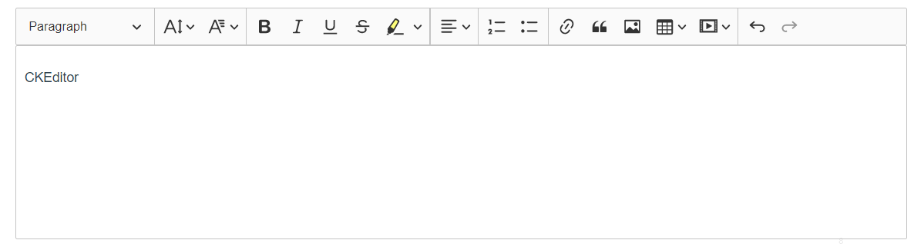

# 富文本 CKEditor 5



## 快速使用
> 当前基于 ckeditor5 Document editor builds 集成部分插件，以满足项目需求。可直接通过`onpm`私有仓库快速下载`icomm-editor`安装使用
#### 安装
```sh
npm install -g nrm
nrm add onpm http://onpm.adc.com
nrm use onpm
npm install icomm-editor
```
#### 调用
```html
<template>
  <div id="app">
    <ckeditor :editor="editor" @ready="onReady"></ckeditor>
  </div>
</template>

<script>
  import CKEditor from '@ckeditor/ckeditor5-vue'
  import IcommEditor from 'icomm-editor'

  export default {
    name: 'ckeditor',
    components: {
      // Use the <ckeditor> component in this view.
      ckeditor: CKEditor.component
    },
    data() {
      return {
        editor: IcommEditor,
        // ...
      }
    },
    methods: {
      onReady( editor )  {
        // Insert the toolbar before the editable area.
        editor.ui.getEditableElement().parentElement.insertBefore(
          editor.ui.view.toolbar.element,
          editor.ui.getEditableElement()
        );
      }
    }
  }
</script>
```
使用详情参考[API](/components/richtext.html#api)，开发详情参考[icomm-editor](/components/richtext.html#icomm-editor)
## CKEditor 5 Builds
CKEditor 5 Builds是一组随时可用的富文本编辑器。每个“builds”都提供一种具有一组功能和默认配置的编辑器类型。可以直接安装使用，并满足常见的编辑用例。

### 可用的 Builds

#### Classic editor
`Classic editor` 显示一个带工具栏的盒式编辑区域，该区域位于页面上的特定位置，通常作为表单的一部分，用于向服务器提交某些内容。
- 当用户向下滚动页面时，工具栏当前总是可见的。
- 编辑器内容以内联方式放置在页面中（没有`<iframe>`元素包围）,更容易设置样式。
- 默认情况下，编辑器会随内容自动增长

[classic editor 示例](https://ckeditor.com/docs/ckeditor5/latest/examples/builds/classic-editor.html)

#### Inline editor
`Inline editor` 附带一个浮动工具栏，当编辑器聚焦时（例如，通过单击它）该工具栏变为可见。与`Classic editor`不同，`Inline editor`不呈现给定的元素，它只是使其可编辑。因此，在创建编辑器之前和之后，编辑内容的样式将完全相同。为用户提供在网页的真实位置编辑内容的可能性，而不是在单独的管理部分中进行编辑

[inline editor 示例](https://ckeditor.com/docs/ckeditor5/latest/examples/builds/inline-editor.html)

#### Balloon editor
`Balloon editor`与`Inline editor`非常相似。它们之间的区别在于，工具栏显示在所选内容旁边的气球中（当所选内容不为空时）

[balloon editor 示例](https://ckeditor.com/docs/ckeditor5/latest/examples/builds/balloon-editor.html)

#### Balloon block editor
`Balloon block editor` 本质上是`Balloon editor`，带有一个额外的块工具栏。允许使用两个工具栏直接在目标位置创建内容
：显示在选定的可编辑文档元素旁边的气球工具栏（提供内联内容格式设置工具）；一个块工具栏，可以使用附加到可编辑内容区域的按钮并跟随文档中的选择进行访问。

[balloon block editor 示例](https://ckeditor.com/docs/ckeditor5/latest/examples/builds/balloon-block-editor.html)

#### Document editor
`Document editor`专注于富文本编辑体验，类似于本机字处理器。适合创建文档，这些文档通常在以后打印或导出为pdf文件。

[ document editor 示例](https://ckeditor.com/docs/ckeditor5/latest/examples/builds/document-editor.html)

> 每个构建都带有一组默认功能及其默认配置。尽管构建试图适应许多用例，但在某些集成中可能仍需要对它们进行调整。后续会详细介绍其使用及配置等

### 安装

#### 各个build对应依赖
```sh
# Classic editor
npm install --save @ckeditor/ckeditor5-build-classic
# Inline editor
npm install --save @ckeditor/ckeditor5-build-inline
# Balloon editor
npm install --save @ckeditor/ckeditor5-build-balloon
# Balloon block editor
npm install --save @ckeditor/ckeditor5-build-balloon-block
# Document editor
npm install --save @ckeditor/ckeditor5-build-decoupled-document
```
#### vue应用中安装
```sh
npm install --save @ckeditor/ckeditor5-vue @ckeditor/ckeditor5-build-[name]  
# name 对应各个build，选择当前需要的编辑器类型
```

### 使用
> 文档以`Classic editor`为例，其他builds工作方式相同
1. CKEditor导入应用
```js
// main.js
import Vue from 'vue'
import CKEditor from '@ckeditor/ckeditor5-vue'

Vue.use(CKEditor)
```
2. 应用程序的组件中，引用`<ckeditor>`组件
```html
<template>
  <div class="ckeditor">
    <ckeditor :editor="editor" v-model="editorData" :config="editorConfig"></ckeditor>
    <button v-on:click="emptyEditor()">清空</button>
  </div>
<template>
<script>
  import ClassiCKEditor from '@ckeditor/ckeditor5-build-classic';

  export default {
    name: 'ckeditor',
    data() {
      return {
        editor: ClassiCKEditor,
        editorData: '<p>Content of the editor.</p>',
        editorConfig: {
          // The configuration of the editor.
        }
      };
    },
    methods: {
      emptyEditor () {
        this.editorData = ''
      }
    }
  }
</script>
```
#### 使用Document editor
如果在应用程序中使用`Document editor`，则需要手动将编辑器工具栏添加到dom中。由于在编辑器实例准备好之前无法访问编辑器工具栏，请将工具栏插入代码放入在组件的ready事件上执行的方法中。如下：
```html
<template>
  <div id="app">
    <ckeditor :editor="editor" @ready="onReady"></ckeditor>
  </div>
</template>

<script>
  import DecoupledEditor from '@ckeditor/ckeditor5-build-decoupled-document';

  export default {
    name: 'app',
    data() {
      return {
        editor: DecoupledEditor,
        // ...
      }
    },
    methods: {
      onReady( editor )  {
        // Insert the toolbar before the editable area.
        editor.ui.getEditableElement().parentElement.insertBefore(
          editor.ui.view.toolbar.element,
          editor.ui.getEditableElement()
        );
      }
    }
  }
</script>
```

#### 组件指令
- `editor`：指定组件要使用的编辑器。它必须直接引用要在模板中使用的编辑器构造函数
- `v-model`：双向数据绑定值。可以用于更改或设置编辑器的初始内容，获取当前编辑器内容
- `config`：指定编辑器配置，[参数](#editconfig)
- `tag-name`：编辑器默认创建一个`<div>`容器，用作传递给编辑器的元素。可以配置元素类型。例如创建一个`<textarea>`
> CKEditor组件会创建一个不可见元素，存储编辑器内容，默认为`<div>`，可通过`tag-name`配置为别的元素
```html
<ckeditor :editor="editor" tag-name="textarea"></ckeditor>
```
- `value`：单向数据绑定。与`v-model`不同，该值在编辑器内容更改时不会更新。
```html
<ckeditor :editor="editor" :value="editorData"></ckeditor>
```
- `disabled`：设置编辑器的初始只读状态，并在其生命周期中对其进行更改
> 该组件与Vue.js 2.x兼容

#### 组件事件
- `ready`：当数据和所有其他编辑器组件就绪时激发。[ready](https://ckeditor.com/docs/ckeditor5/latest/api/module_core_editor_editor-Editor.html#event-ready)
>此事件对插件开发人员最有用。在将编辑器与网站或应用程序集成时，不必监听`editor#ready`，因为在解析`editor.create()`事件返回时，编辑器已经准备就绪。事实上，由于编辑器实例对您可用的第一个时刻在`then()`的回调中，您甚至不能向`editor#ready`添加侦听器。
```html
<ckeditor :editor="editor" @ready="onEditorReady"></ckeditor>
```
- `focus`：获得焦点时激发。[focus](https://ckeditor.com/docs/ckeditor5/latest/api/module_engine_view_document-Document.html#event-event:focus)
```html
<ckeditor :editor="editor" @focus="onEditorFocus"></ckeditor>
```
- `blur`：失去焦点时激发。[blur](https://ckeditor.com/docs/ckeditor5/latest/api/module_engine_view_document-Document.html#event-event:blur)
```html
<ckeditor :editor="editor" @blur="onEditorBlur"></ckeditor>
```
- `input`：数据更改时激发。
```html
<ckeditor :editor="editor" @input="onEditorInput"></ckeditor>
```
- `destroy`：销毁编辑器事件。[destroy](https://ckeditor.com/docs/ckeditor5/latest/api/module_core_editor_editor-Editor.html#event-destroy)
> 因为编辑器的破坏是由promise驱动的，所以可以在实际promise解决之前触发此事件
```html
  <ckeditor :editor="editor" @destroy="onEditorDestroy"></ckeditor>
```

#### 编辑器数据操作
- `setData()`：设置编辑器数据
```js
editor.setData( '<p>Some text.</p>' )
```
> Vue.js组件引用编辑器，数据通过`v-model`双向或`value`单项绑定，直接更改对应参数的值即可设置编辑器数据，一般情况不会使用的该方法
- `getData()`：获取编辑器内容数据
```js
const data = editor.getData()
```
> Vue.js组件引用编辑器，数据通过`v-model`双向数据绑定时，直接读取绑定参数的值即编辑器当前内容数据，无需调用该方法。数据通过`value`单项绑定时，更改编辑器内容，绑定的对应参数值不会更改，需要调用该方法获取编辑器内容
- `destroy()`：销毁编辑器实例
```js
editor.destroy()
  .catch( error => {
    console.log( error )
  })
```
> 编辑器实例被销毁，其使用的资源将被释放，用于创建编辑器的原始元素将自动显示和更新，以反映最终的编辑器数据。

### 在本地组件使用
如果不希望全局启用`ckeditor`组件，可以完全跳过`vue.use(ckeditor)`部分。在视图的“组件”属性中配置它。
```html
<template>
  <div class="ckeditor">
    <ckeditor :editor="editor"></ckeditor>
  </div>
<template>
<script>
  import CKEditor from '@ckeditor/ckeditor5-vue'
  import ClassiCKEditor from '@ckeditor/ckeditor5-build-classic';

  export default {
    name: 'ckeditor',
    components: {
      // Use the <ckeditor> component in this view.
      ckeditor: CKEditor.component
    },
    data() {
      return {
        editor: ClassiCKEditor,
      };
    }
  }
</script>
```
## API
> 以`Document editor`使用为例

- `toolbar`: 编辑器工具栏
```js
const config = {
  toolbar:['Heading', '|', 'Blod',....]
}
```
- `removePlugins`：移除编辑器工具栏中的项，编辑器插件
```js
  const config = {
    removePlugins: [ 'Heading', 'MediaEmbed']  // 去除标题，多媒体
  }
```
#### 工具栏（toolbar）
- `bold`：粗体
- `italic`：斜体
- `blockQuote`：引用
- `Underline`：下划线
- `strikethrough`：中划线
- `undo`：撤销
- `redo`：恢复上一步操作
- `heading`：标题
  ```js
  const config = {
    toolbar: [ 'heading'],
      heading: {
        options: [   // 标题类型定义
          { model: 'paragraph', title: 'Paragraph', class: 'ck-heading_paragraph' },
          { model: 'heading1', view: 'h1', title: 'Heading 1', class: 'ck-heading_heading1' },
          { model: 'heading2', view: 'h2', title: 'Heading 2', class: 'ck-heading_heading2' }
        ]
      }
    }
  ```
  <rich-text :editorConfig="{
                              toolbar: [
                                'heading', '|'
                              ],
                              heading: {
                                options: [
                                  { model: 'paragraph', title: 'Paragraph', class: 'ck-heading_paragraph' },
                                  { model: 'heading1', view: 'h1', title: 'Heading 1', class: 'ck-heading_heading1' },
                                  { model: 'heading2', view: 'h2', title: 'Heading 2', class: 'ck-heading_heading2' }
                                ]
                              }    
                            }" 
            editorData="标题">
  </rich-text>
- `Alignment`：文本对齐方式：`left`, `right`, `center`, `justify`
    - 通过设置`alignment.options`配置选项，配置对齐下拉选项
    ```js
    // 仅left，right两种对齐方式
    const config = {
      toolbar: [
        'heading', '|','alignment'
      ],
      alignment: {
        options: [ 'left', 'right' ]
      }     
    }
    ```
    <rich-text :editorConfig="{
                                toolbar: [
                                  'heading', '|','alignment'
                                ],
                                alignment: {
                                  options: [ 'left', 'right' ]
                                }     
                              }" 
                editorData="<p>左对齐</p><p style='text-align:right;'>右对齐</p>">
    </rich-text>
    
    - 对齐方式配置为工具栏按钮
    ```js
    // 仅left，right两种对齐方式
    const config = {
      toolbar: [
        'heading', '|', 'alignment:left', 'alignment:right', 'alignment:center', 'alignment:justify'
      ]     
    }
    ```
    <rich-text :editorConfig="{
                                toolbar: [
                                  'heading', '|', 'alignment:left', 'alignment:right', 'alignment:center', 'alignment:justify'
                                ]      
                              }" 
                editorData="<p>左对齐</p><p style='text-align:right;'>右对齐</p>">
    </rich-text>
- `balloonToolbar`：上下文工具栏配置。可用于`Balloon editor`
  ```js
  const config = {
    balloonToolbar: [ 'bold', 'italic', 'undo', 'redo' ] // 可用'|'将工具按钮分开   [ 'bold', '|', 'italic', 'undo', 'redo' ]
  }
  ```
- `blockToolbar`：块工具栏配置。可用于`Balloon block editor`
  ```js
  const config = {
    blockToolbar: [ 'paragraph', 'heading1', 'heading2', 'bulletedList', 'numberedList' ] //也可使用'|'
  }
  ```
- `Autoformat`：`ckeditor 5`的自动格式化功能，允许通过键入类似`**粗体this**`，`+ 序列`的序列来设置文本的样式。默认支持，无需配置，可通过`removePlugins`移除
- `extraPlugins`：插件扩展。仅适用于使用[插件接口](https://ckeditor.com/docs/ckeditor5/latest/api/module_core_plugin-PluginInterface.html)且没有依赖项的简单插件
- `fontBackgroundColor`：字体背景颜色配置
   `colors`：定义为字符串或对象数组的可用字体背景色
   `columns`：表示字体背景颜色下拉列表中的列数
   `documentColors`：确定可用文档颜色的最大数目。将其设置为0将禁用文档颜色功能
- `fontColor`：字体颜色配置
- `fontFamily`：字体类型配置
  ```js
  const config = {
    fontFamily: {
      options: [
        'Arial, Helvetica, sans-serif',
        'Courier New, Courier, monospace',
        'Times New Roman, Times, serif'
      ]
    }
  }
  ```
  <rich-text :editorConfig="{
                              toolbar: [
                                'heading', '|','fontFamily'
                              ],
                              fontFamily: {
                                options: [
                                  'Arial, Helvetica, sans-serif',
                                  'Courier New, Courier, monospace',
                                  'Times New Roman, Times, serif'
                                ]
                              }    
                          }" 
            editorData="字体设置">
  </rich-text>
- `fontSize`：字体大小配置。取值可以为数字，或者 `tiny`, `small`, `big`, `huge`
  ```js
  const config = {
    fontSize: {
      options:[
          'tiny',
          'small',
          'default',
          'big',
          'huge'
      ]
      // 或  [ 9, 10, 11, 12, 13, 14, 15 ]
    }
  }
  ```
  <rich-text :editorConfig="{
                              toolbar: [
                                'heading', '|','fontSize'
                              ],
                              fontSize: {
                                options: [ `tiny`, `small`, `big`, `huge`, 9, 10, 11, 12, 13, 14, 15 ]
                              }    
                            }" 
            editorData="字体大小">
  </rich-text>
- `highlight`: 字体高亮设置，[取值项](https://ckeditor.com/docs/ckeditor5/latest/api/module_highlight_highlight-HighlightConfig.html#member-options)
    
    两种方式设置，`type`取值：

    - `marker`：使用背景色进行样式设置；
    - `pen`：使用字体颜色进行样式设置；样式表定义css类及css变量对应的颜色
  ```js
  const config = {
    highlight: {
      options: [
        {
          model: 'yellowMarker',
          class: 'marker-yellow',
          title: 'Yellow marker',
          color: 'var(--ck-highlight-marker-yellow)',
          type: 'marker'   // 背景色
        },
        {
          model: 'redPen',
          class: 'pen-red',
          title: 'Red pen',
          color: 'var(--ck-highlight-pen-red)',
          type: 'pen'   // 字体颜色
        }
      ]
    }
  }
  ```
  <rich-text :editorConfig="{
                              toolbar: [
                                'heading', '|','highlight'
                              ],
                              highlight: {
                                options: [
                                  {
                                    model: 'yellowMarker',
                                    class: 'marker-yellow',
                                    title: 'Yellow marker',
                                    color: 'var(--ck-highlight-marker-yellow)',
                                    type: 'marker'   // 背景色
                                  },
                                  {
                                    model: 'redPen',
                                    class: 'pen-red',
                                    title: 'Red pen',
                                    color: 'var(--ck-highlight-pen-red)',
                                    type: 'pen'   // 字体颜色
                                  }
                                ]
                              }   
                            }" 
            editorData='<p><mark class="marker-yellow">字体高亮</mark></p>'>
  </rich-text>
  
  `highlight`也可以将选项直接设置为工具栏按钮
  ```js
  const config = {
    toolbar: [ 'highlight:greenMarker', 'highlight:greenPen']
  }
  ```
  
  <rich-text :editorConfig="{
                              toolbar: [
                                'heading', '|','highlight:greenMarker', 'highlight:greenPen'
                              ],
                            }" 
            editorData='<p><mark class="marker-green">字体高亮</mark></p>'>
  </rich-text>
- `removeHighlight`：移除高亮项
- `list`列表项
  - `numberedList`：有序列表
  - `bulletedList`：无序列表
  - `todoList`：代办列表
  <rich-text :editorConfig="{
                              toolbar: [
                                'heading', '|','numberedList', 'bulletedList'
                              ]   
                            }" 
            editorData="<ol><li>列表项1</li><li>列表项2</li><li>列表项3</li></ol>">
  </rich-text>
- `table`：表格，工具栏配置名称`insertTable`
  ```js
  const config = {
    toolbar: ['heading', '|', 'insertTable']
  }
  ```
  - `contentToolbar`：表单元格内容工具栏，即可通过该工具栏选项对选中的单元格进行操作。取值：`tableRow`(行操作), `tableColumn`(列操作), `mergeTableCells`(单元格合并操作)。默认都有，去除直接定义为空数据`[]`。
  ```js
  const config = {
    toolbar: ['heading', '|', 'insertTable'],
    table: {
      contentToolbar: ['tableRow','tableColumn']
    }
  }
  ```
  `tableRow`, `tableColumn`, `mergeTableCells`可直接定义为编辑器工具栏选项。
  ```js
  const config = {
    toolbar: ['heading', '|', 'insertTable', `tableRow`, `tableColumn`, `mergeTableCells`],
  }
  ```
  - `tableToolbar`：表格操作工具栏，即选中表格时，可通过该工具栏选项，对表格内容进行操作。取值与`toolbar`相同。例如取值包含`bold`，可对表格操作，使其内容字体加粗
  ```js
  const config = {
    toolbar: ['heading', '|', 'insertTable'],
    table: {
      tableToolbar: ['bold', 'italic']
    }
  }
  ```
  <rich-text :editorConfig="{
                              toolbar: [
                                'heading', '|','insertTable', 'blockQuote'
                              ],
                              table: {
                                contentToolbar: ['tableRow', 'tableColumn'],
                                tableToolbar: ['bold', 'italic']
                              }
                            }" 
            editorData="表格">
  </rich-text>
>  注意：当前表格不支持操作表格自定义样式，若需要更改表格样式，可通过更改其css样式，来定义表格样式。
- `image`：图片，工具栏配置名称`imageUpload`。
  ```js
  const config = {
    toolbar:['imageUpload', '|']
  }  
  ```
  需要配置文件上载适配器才可完成图片上传。将图像上载到服务器，然后服务器提供`ckeditor 5`用于在文档中显示图像的图像url
  - 自定义上载适配器。[官方文档](https://ckeditor.com/docs/ckeditor5/latest/framework/guides/deep-dive/upload-adapter.html#the-anatomy-of-the-adapter)
    1. 自定义上载适配器
    ```js
    class MyUploadAdapter {
      constructor( loader ) {
        // 上载过程中要使用的文件加载程序实例
        this.loader = loader
      }

      // 启动上载过程，结合项目中axios请求封装
      upload () {
        return this.loader.file
            .then(file => new Promise((resolve, reject) => {
              // 文件上传过程实现,uploadImgRequest为项目中上传图片接口api
              /**
               * export function uploadImgFile (data, progress) {
                  return request({
                    url: '/mp/consoleapi/file/uploadImgFile',
                    method: 'post',
                    onUploadProgress: progress,   // 接口访问进度
                    data
                  })
                }
               */
              uploadImgRequest(data,(evt) => {
                // 上传进度条
                if (evt.lengthComputable) {
                  this.loader.uploaded = evt.loaded
                  this.loader.uploadTotal = evt.total
                }
              }).then(res => {
                resolve({
                  default: res.data.imgUrl // 成功，将接口返回的图片路径赋值给default，将用于显示内容中的图像
                })
              }).catch(err => {
                reject(err)
              })
            }) 
        )
      }

      abort () {
        // 中止上载过程
      } 
    }
    ```
    2. 通过定义`filerepository.createUploadAdapter()`工厂方法，在编辑器中启用上载适配器。
    ```js
    editor.plugins.get( 'FileRepository' ).createUploadAdapter = loader => {
        return new MyUploadAdapter( loader )  // MyUploadAdapter 自定义上载适配器
    }
    ```
  - 可集成`CKFinder`使用，涉及到后端配置，不做介绍。[官方文档](https://ckeditor.com/docs/ckeditor5/latest/features/image-upload/ckfinder.html)
  <rich-text :editorConfig="{
                              toolbar: [
                                'imageUpload', '|'
                              ],
                            }" 
            editorData="图片">
  </rich-text>
- `iamgeStyle`：图片样式，这只图片显示方式
  ```js
  const config = {
    toolbar:['imageUpload', '|'],
    image: {
      styles: [ 'full', 'side' ]  // full：不使用任何样式
    }
  } 
  ```
- `placeholder`：编辑器没有内容时显示的提示文本
- `link`：[链接](https://ckeditor.com/docs/ckeditor5/latest/api/module_link_link-LinkConfig.html)
- `MediaEmbed`：[多媒体](https://ckeditor.com/docs/ckeditor5/latest/api/module_media-embed_mediaembed-MediaEmbedConfig.html)
- `plugins`：需要加载的[插件列表](https://ckeditor.com/docs/ckeditor5/latest/api/module_core_editor_editorconfig-EditorConfig.html#member-plugins)
- `language`：语言[设置](https://ckeditor.com/docs/ckeditor5/latest/api/module_core_editor_editorconfig-EditorConfig.html#member-language)

#### 工具栏可配置项
可通过一下方式获取当前编辑器工具栏可配置项
```js
  Array.from(editor.ui.componentFactory.names())
```
#### 各builds支持的 plugins API
在页面中创建编辑器时，可以设置更改其许多方面的配置。对于Builds来说，均有自己默认的配置。

当前所有的Builds均支持的配置：`CKFinderUploadAdapter`, `Autoformat`, `Bold`, `Italic`, `BlockQuote`, `CKFinder`, `EasyImage`, `Heading`, `Image`, `ImageCaption`, `ImageStyle`, `ImageToolbar`, `ImageUpload`, `Link`, `List`, `MediaEmbed`, `Paragraph`, `PasteFromOffice`, `Table`, `TableToolbar`

其中`Document editor`还支持：`Alignment`, `FontSize`, `FontFamily`, `Highlight`, `Strikethrough`, `Underline`

可以通过以下方式获取当前编辑器支持的配置项
```js
// 以ClassicEditor为例
ClassicEditor.builtinPlugins.map( plugin => plugin.pluginName )\
```
对于不支持的插件，需要单独引入，配置到当前编辑器中

## 插件安装
### 向已有builds添加插件
1. 下载builds库，安装其需要的插件。存放路径为项目中插件路径，即`项目目录\node_modules\@ckeditor`
```sh
git clone -b stable https://github.com/ckeditor/ckeditor5-build-classic.git
cd ckeditor5-build-classic
npm install
```
2. 安装需要添加的插件包，以`fontColor`为例
```sh
npm install --save-dev @ckeditor/ckeditor5-font
```
3. 将其添加到配置中，`src/ckeditor.js`
```js
import FontColor from '@ckeditor/ckeditor5-font/src/fontcolor';

DecoupledEditor.builtinPlugins = [
  ...,
  FontColor,
  ...
]

DecoupledEditor.defaultConfig = [
  toolbar: {
    items: [
      ...,
      'fontcolor',
      ...
    ]
  }
]
```
4. 捆绑构建
```sh
yarn run build
```
5. 插件引入结束，接下来就可以在项目中，对新引入的插件进行配置使用了。

### icomm-editor
1. 下载`icomm-editor`库，安装依赖
```sh
git clone git@gitlab.adc.com:oppo-front/icomm-ckeditor.git
cd icomm-ckeditor
npm install
```
2. 安装需要添加的插件包，以`fontColor`为例
```sh
npm install --save-dev @ckeditor/ckeditor5-font
```
3. 将其添加到配置中，`src/ckeditor.js`
```js
import FontColor from '@ckeditor/ckeditor5-font/src/fontcolor';

DecoupledEditor.builtinPlugins = [
  ...,
  FontColor,
  ...
]

DecoupledEditor.defaultConfig = [
  toolbar: {
    items: [
      ...,
      'fontcolor',
      ...
    ]
  }
]
```
4. 修改package.json版本号
5. 编译
```sh
yarn run build
```
6. 集成包发布onpm
```sh
npm publish
```
7. 可以通过onpm私库下载使用了，下载的依赖具有新集成的插件功能

> 插件类型查看[官网API](https://ckeditor.com/docs/ckeditor5/latest/api/index.html)


