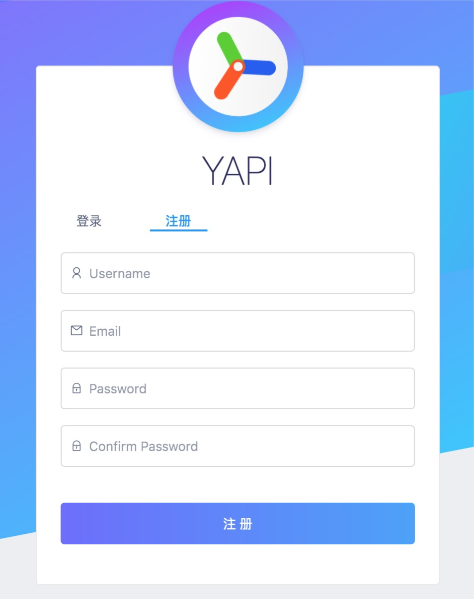

# yapi

[yapi](http://yapi.adc.com) 是一款开源的，可以本地部署的，可视化接口管理平台

## 登录与注册

在登录页面, 点击登录/注册后, 切换到注册tab

输入用户名-邮箱-密码即可，建议内部员工使用工号以及OPPO邮箱注册

注册完成登录即可进入主页面

## 首页

登录后进入首页，首页展示了分组与项目。

此时你作为新用户，没有任何分组与项目的权限，因此只能搜索、浏览 “公开项目” 的接口，如果在首页找不到任何项目，请联系管理员将你加入对应项目。

1. 首页头部展示了当前所在的位置、搜索框、新建项目、查看文档和用户信息。

2. 首页左侧展示分组信息，“分组”是“项目”的集合，只有超级管理员可以管理分组。

3. 首页右侧是分组下的项目和成员列表，点击左侧的某个分组，右侧会出现该分组下的项目和成员信息。

4. 点击项目右上角的星星即可关注项目，关注的项目可以在“我的关注”页面查看。

详细查看[YAPI文档](https://hellosean1025.github.io/yapi/documents)