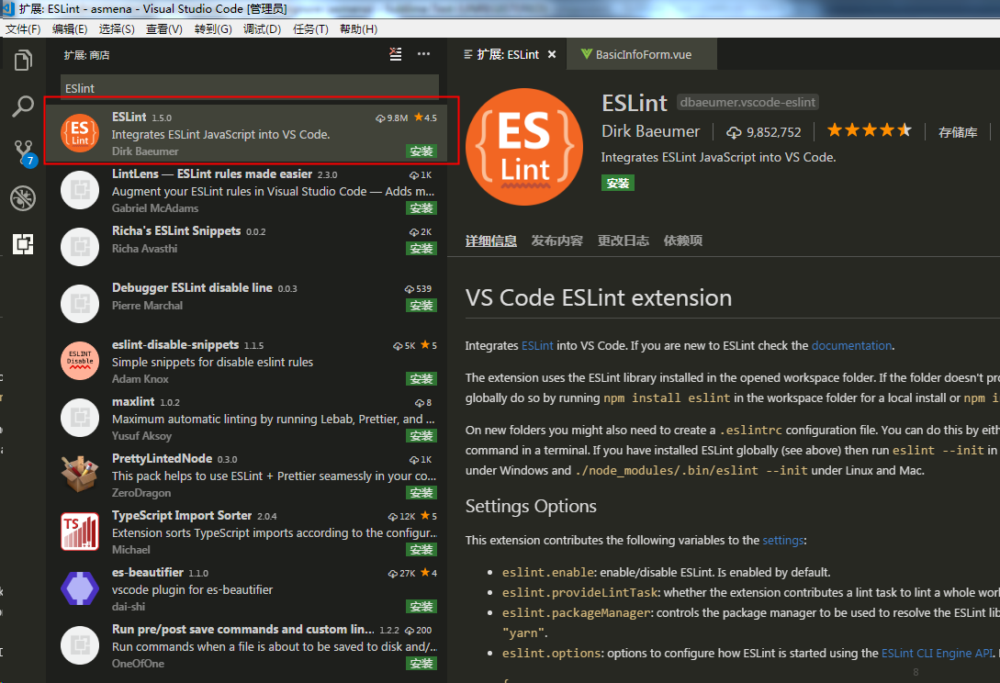
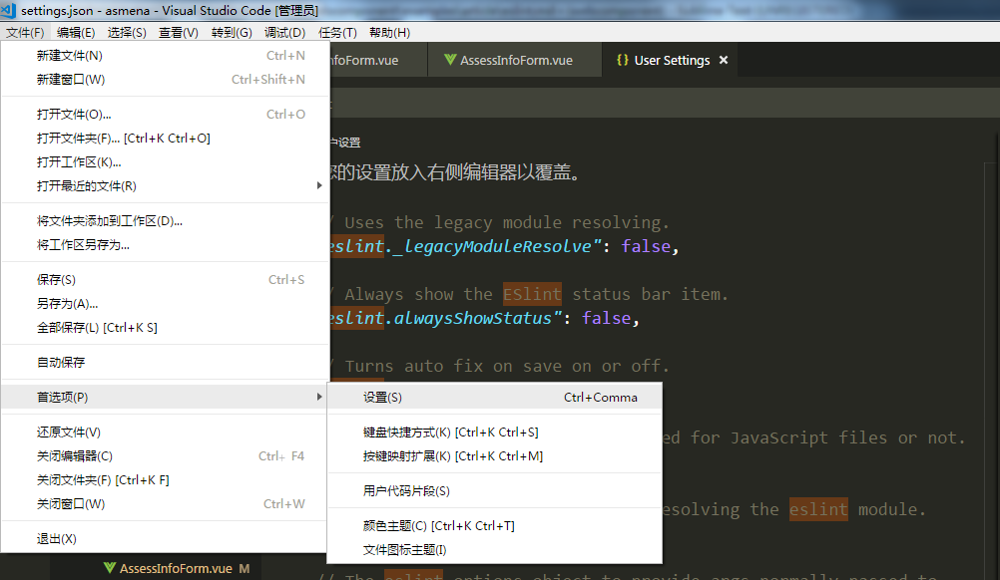

# ESLint规范

> javascript代码风格规范

## 1 前言

`ESlint` 是一个 `Javascript` 代码检查工具, 代码检查是一种静态的分析，常用于寻找有问题的模式或者代码，并且不依赖于具体的编码风格。对大多数编程语言来说都会有代码检查，一般来说编译程序会内置检查工具。当开发人员数量不再限于三两个人时，一套统一的框架，编程思维，编程规范所节约的沟通成本是不需要多说的。更重要的是使用ESLint的过程中，我们能够接触到所有开发者所公认的代码规范，能够有机会学习并理解代码规范背后的原因。

本文档主要在于说明 `ESLint` 代码配置的规范并应用在项目中，统一所有项目的 `JavaScript` 代码风格。

## 2 ESLint规则

`ESLint` 的规则分为：

* Possible Errors // 可能导致错误
* Best Practices  // 最佳实践
* Strict Mode     // 严格模式相关
* Variables       // 变量定义相关
* Node.js and CommonJS // node.js或者浏览器使用CommonJS
* Stylistic Issues // 风格指南
* ECMAScript 6 // ES6，即ES2005相关

## 3 ESLint规范配置
**[强制] `Javascript` 代码风格推荐用 [recommended](https://cn.eslint.org/docs/rules/)。**

eslint --init 初始化时选择 recommended 风格

**[强制] 所有同学在编码前请阅读 [recommended](https://cn.eslint.org/docs/rules/) 。并且严格遵循。**

**[强制] 前端项目必须接入 `ESLint`。**

## 4 项目配置

**[建议]前端项目建议质量保证方式使用 [`ESLint`](https://cn.eslint.org/) + [`husky`](https://github.com/typicode/husky)。**

`husky` 让配置 `git hooks` 更加简单。 配置好 `husky` 之后可以在 `git commit` 和 `git merge` 检测 `eslint` ，没有通过检测会提示错误，并显示提交失败。

```json
npm install husky --save-dev
// package.json
{
  "husky": {
    "hooks": {
      "pre-commit": "npm run eslint",
      "pre-merge": "npm run eslint",
      "...": "..."
    }
  }
}
```

## 5 统一配置规范

`Vue` 配置规范

可以将下列代码 `Copy` 到 `.eslintrc.js` 文件中

```js
module.exports = {
  "root": true,
  "env": {
    "node": true
  },
  "extends": [
    "plugin:vue/essential",
    "eslint:recommended"
  ],
  "rules": {},
  "parserOptions": {
    "parser": "babel-eslint"
  }
}
```

## 6 VSCode配置

* 安装ESLint插件

 

* 对 `ESLint` 进行配置, 搜索 Auto Fix on Save, 打勾就可以了

