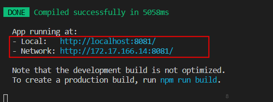

# 开发指南

## 快速体验

> 在使用前请确认本地已经安装配置好Node环境, 如果您还没有安装Node, 请点击[`此处`](http://nodejs.cn/download/)按照官方文档安装

项目基于[Vue-Cli3](https://cli.vuejs.org/zh/guide/)搭建

1. 可以使用`icomm-cli`安装模块或者从`gitlab`下载

  + 使用脚手架安装模版需要配置[`onpm源`](/ecology/onpm)并安装[`icomm-cli`](/ecology/scaffold)
    ```sh
    # 安装nrm, 如已安装则忽略
    npm install -g nrm
    # 配置onpm源, 如已配置则忽略
    nrm add onpm http://onpm.adc.com
    npm use onpm
    # 安装icomm-cli, 如已安装则忽略
    npm install -g icomm-cli
    # 初始化PC端模版
    icomm init icomm-pc `${projectPCName}`
    # 初始化H5端模版
    icomm init icomm-h5 `${projectH5Name}`
    ```
  + 从gitlab下载
    ```sh
    # 移动端模板 
    git clone git@gitlab.adc.com:oppo-front/icomm-h5-template.git
    # PC端模板
    git clone git@gitlab.adc.com:oppo-front/icomm-pc-template.git
    ```

2. 代码下载完成，以此代码为项目初始代码，创建自己的代码仓库。以该仓库代码为主干，进行实际项目开发

3. 安装项目依赖 `npm install`。依赖安装成功，目录中增加 `node_modules` 文件夹。
```sh
npm install
#或 yarn
```
私有库依赖安装：我们拥有自己的私有组件库。开发过程中，引用私有组件库组件时，需要安装私有库依赖到本地
```sh
npm install -g nrm   # nrm可以用来管理自己的npm代理，快速修改、切换、增加npm镜像地址
nrm add onpm http://onpm.adc.com  # 增加私有仓库
nrm use onpm #切换到私有仓库
npm install o-ui
```
4. 项目运行

运行，执行`npm run`或`yarn` 加 `指令`
```sh
# 本地运行
npm run serve
# 或 yarn serve
```
运行指令定义在`package.json`的`scripts`字段中
``` json
// package.json
{
  "scripts": {
    "serve": "vue-cli-service serve", // 本地搭建一个HTTP服务，用于运行当前项目，使其能够在浏览器中直接运行
    "build": "vue-cli-service build", // 项目构建，编译当前项目，生成可用于发布的代码
    "lint": "vue-cli-service lint", // 根据集成的规范，自动整理和修复文件
    "test:unit": "vue-cli-service test:unit" // 运行单元测试 
  }
}
```
> 各项目实际指令名称可能有所差异，可查看项目README.md文档，其中有对运行语句进行说明

6. 浏览器访问运行地址。

项目运行成功，运行面板展示访问地址。浏览器访问该地址，展示当前项目效果




7. 本地运行环境搭建成功，可以开始开发啦。

## 开发

> 使用前请确保您有`Vue.js`基础, 点此前往[`Vue官网`](https://cn.vuejs.org/v2/guide/)学习

### 目录结构

```sh
├── dist                  # 运行npm build，编译后生成的代码存放目录
├── node_modules          # npm本地依赖包
├── public                # 该目录下的静态资源会被复制到输出目录（dist）中，不经过 webpack处理
├── src
│   ├── api               # 与后端交互使用相关方法，接口定义
│   ├── assets            # 放置一些静态资源，例如图片，图标，字体等
│   ├── components        # 公共组件  
│   ├── lang              # 国际化多语言定义 
│   ├── router            # vue-router相关配置 https://router.vuejs.org/zh/guide/
│   ├── store             # vuex 相关配置 https://vuex.vuejs.org/zh/
│   ├── styles            # 公共样式定义
│   ├── theme             # 主题定义
│   ├── utils             # 工具类定义，详细请阅读“工具类”部分介绍
│   ├── views             # 所有的路由组件，业务功能开发
│   ├── App.vue           # 路由组件的顶层路由
│   └── main.js           # vue入口文件
├── tests                 # 测试
├── .browserslistrc       # 指定项目的目标浏览器的范围，查看“配置项-目标浏览器”了解
├── .env                  # 环境变量配置，详细请阅读“环境变量和模式”部分介绍
├── .gitignore            # 配置不提交到git仓库的文件
├── postcss.config.js     # 配置rem转换，查看“配置项 - postcss.config.js”了解
└── vue.config.js         # 配置文件，详细请阅读“配置项-vue.config.js”部分
```
开发详情：[移动端](/guide/mobile), [PC端](/guide/pc)

### 配置项

#### *vue.config.js*

`vue.config.js`是一个可选的配置文件，定义在根目录，可用于定义基本 URL、入口文件、webpack配置、loader、端口信息等

每次在终端运行`vue-cli-service`时，都会先找到对应的`vue.config.js`，获取到相关配置，才继续执行其它操作
``` js
// vue.config.js
export default = {
  // 部署应用包时的基本 URL，默认为'/'
  publicPath: process.env.NODE_ENV === 'production'
    ? '/production-sub-path/'
    : '/',
  
  // 当运行 vue-cli-service build 时生成的生产环境构建文件的目录。
  // 目标目录在构建之前会被清除 (构建时传入 --no-clean 可关闭该行为)。
  outputDir: 'dist',

  // 放置生成的静态资源 (js、css、img、fonts) 的 (相对于 outputDir 的) 目录。
  assetsDir: 'static',

  // 指定生成的 index.html 的输出路径 (相对于 outputDir)。也可以是一个绝对路径
  indexPath: 'index.html',

  // 生成的静态资源在它们的文件名中包含了 hash 以便更好的控制缓存
  filenameHashing: true,

  // 在 multi-page 模式下构建应用。每个“page”应该有一个对应的 JavaScript 入口文件。其值应该是一个对象，对象的 key 是入口的名字
  // 当在 multi-page 模式下构建时，webpack 配置会包含不一样的插件 (这时会存在多个 html-webpack-plugin 和 preload-webpack-plugin 的实例)。如果你试图修改这些插件的选项，请确认运行 vue inspect
  pages: {
    index: {
      // page 的入口
      entry: 'src/index/main.js',
      // 模板来源
      template: 'public/index.html',
      // 在 dist/index.html 的输出
      filename: 'index.html',
      // 当使用 title 选项时，
      // template 中的 title 标签需要是 <title><%= htmlWebpackPlugin.options.title %></title>
      title: 'Index Page',
      // 在这个页面中包含的块，默认情况下会包含
      // 提取出来的通用 chunk 和 vendor chunk。
      chunks: ['chunk-vendors', 'chunk-common', 'index']
    },
    // 当使用只有入口的字符串格式时，
    // 模板会被推导为 `public/subpage.html`
    // 并且如果找不到的话，就回退到 `public/index.html`。
    // 输出文件名会被推导为 `subpage.html`。
      subpage: 'src/subpage/main.js'
  }

  // 是否在开发环境下通过 eslint-loader 在每次保存时 lint 代码
  // 设置 lintOnSave: 'error' 会强制 eslint-loader 将 lint 错误输出为编译错误，即 lint 错误将会导致编译失败。
  lintOnSave: true,

  // 是否使用包含运行时编译器的 Vue 构建版本
  runtimeCompiler: false,

  // 默认情况下 babel-loader 忽略其中的所有文件 node_modules，
  // 想要通过 Babel 显式转译一个依赖，可以在这个选项中列出来
  transpileDependencies: [],

  // 生产环境的 source map
  productionSourceMap: true,

  // 跨域设置，设置生成的 HTML 中 <link rel="stylesheet"> 和 <script> 标签的 crossorigin 属性
  // 参考值 https://developer.mozilla.org/zh-CN/docs/Web/HTML/CORS_settings_attributes
  crossorigin: undefined,

  // 如果你构建后的文件是部署在 CDN 上的，启用该选项可以提供额外的安全性。
  integrity: false,

  // webpack配置，如果值是对象，则会通过webpack-merge合并。如果是函数则会修改配置
  // https://cli.vuejs.org/zh/guide/webpack.html#%E7%AE%80%E5%8D%95%E7%9A%84%E9%85%8D%E7%BD%AE%E6%96%B9%E5%BC%8F
  configureWebpack: {
    plugins: [
      new MyAwesomeWebpackPlugin()
    ]
  },
  // configureWebpack: config => {}

  // 函数，webpack 链接 API，用于生成和修改 webapck 配置，建议先熟悉webpack-chain和vue-cli 源码，以便更好地理解这个选项的配置项。
  // https://cli.vuejs.org/zh/guide/webpack.html#%E9%93%BE%E5%BC%8F%E6%93%8D%E4%BD%9C-%E9%AB%98%E7%BA%A7
  chainWebpack: config => {
    // 修改vue-loader的配置项
    config.module
      .rule('vue')
      .use('vue-loader')
        .loader('vue-loader')
        .tap(options => {
          // 修改它的选项...
          return options
        })

    // 'src/lib' 目录下为外部库文件，不参与 eslint 检测
    config.module
      .rule('eslint')
      .exclude
      .add('/Users/maybexia/Downloads/FE/community_built-in/src/lib')
      .end()
    
    // 内联的 SVG 文件使用 vue-svg-loader 处理
    const svgRule = config.module.rule('svg')
    // 清除已有的所有 loader。
    // 如果你不这样做，接下来的 loader 会附加在该规则现有的 loader 之后。
    svgRule.uses.clear()
    // 添加要替换的 loader
    svgRule
      .use('vue-svg-loader')
        .loader('vue-svg-loader')
  },
  
  // 配置高于chainWebpack中关于 css loader 的配置
  css: {
    // false时， *.module.[ext] 结尾的文件才会被视作 CSS Modules 模块。
    // true 时，可以去掉文件名中的 .module 并将所有的 *.(css|scss|sass|less|styl(us)?) 文件视为 CSS Modules 模块。
    // https://cli.vuejs.org/zh/guide/css.html#css-modules
    moudles: false,

    // 是否将组件中的 CSS 提取至一个独立的 CSS 文件中 (而不是动态注入到 JavaScript 中的 inline 代码)。
    // 默认生产环境下是 true，开发环境下是 false
    extract: true,

    // 是否构建样式地图，设置为 true 之后可能会影响构建的性能
    sourceMap: false,

    // 向 CSS 相关的 loader 传递选项
    // https://cli.vuejs.org/zh/guide/css.html#%E5%90%91%E9%A2%84%E5%A4%84%E7%90%86%E5%99%A8-loader-%E4%BC%A0%E9%80%92%E9%80%89%E9%A1%B9
    // 支持的loader有 css-loader，postcss-loader，sass-loader，less-loader，stylus-loader
    loaderOptions: {
      css: {
        // 这里的选项会传递给 css-loader
      },
      postcss: {
        // 这里的选项会传递给 postcss-loader
      }
    }
  },

  // 所有 webpack-dev-server 的选项
  // https://webpack.js.org/configuration/dev-server/
  devServer: {
    // 代理配置
    // https://github.com/chimurai/http-proxy-middleware#proxycontext-config
    proxy: '',
    // 即本地编译后的访问地址
    host: '127.0.0.1',
    // 端口
    port: '3000'
  },

  // 第三方插件配置
  pluginOptions: {}   
}
```
> 对于 `CSS` 相关 `loader` 来说，我们推荐使用 `css.loaderOptions` 而不是直接链式指定 `loader`。这是因为每种 `CSS` 文件类型都有多个规则，而 `css.loaderOptions` 可以确保你通过一个地方影响所有的规则。即上述配置中，需要修改`css-loader`配置时，直接修改`css`属性参数，不推荐通过`chainWebpack`来修改

官网[配置参考](https://cli.vuejs.org/zh/config/#vue-config-js)

#### *postcss.config.js*
[postcss-loader](https://github.com/postcss/postcss-loader)配置文件，用于处理css编译
常用的postcss插件：
- Autoprefixer：前缀补全
- postcss-px2rem：把px转换成rem

#### *目标浏览器*
`.browserslistrc`文件定义在根目录(或者 `package.json` 文件里的 `browserslist` 字段)，指定项目的目标浏览器的范围。

语法：

- `> 5%` 基于全球使用率统计而选择的浏览器版本范围。`>=`,`<`,`<=`同样适用。
- `> 5% in US` : 同上，只是使用地区变为美国。支持两个字母的国家码来指定地区。[地区码](https://github.com/ben-eb/caniuse-lite/tree/master/data/regions)
- `cover 99.5%` : 使用率总和为99.5%的浏览器版本，前提是浏览器提供了使用覆盖率。
- `cover 99.5% in US` : 同上，只是限制了地域，支持两个字母的国家码。
- `maintained node versions` :所有还被 node 基金会维护的 node 版本。
- `node 10 and node 10.4` : 最新的 node 10.x.x 或者10.4.x 版本。
- `ie 6-8` : 选择一个浏览器的版本范围。
- `Firefox > 20` : 版本高于20的所有火狐浏览器版本。`>=`,`<`,`<=`同样适用。
- `unreleased versions` or `unreleased Chrome versions` : alpha 和 beta 版本。
- `last 2 major versions` or `last 2 ios major versions` :最近的两个发行版，包括所有的次版本号和补丁版本号变更的浏览器版本。
- `since 2015` or `last 2 years` :自某个时间以来更新的版本（也可以写的更具体since 2015-03或者since 2015-03-10）
- `dead` :通过`last 2 versions`筛选的浏览器版本中，全球使用率低于0.5%并且官方声明不在维护或者事实上已经两年没有再更新的版本。目前符合条件的有 IE10,IE_Mob 10,BlackBerry 10,BlackBerry 7,OperaMobile 12.1。
- `last 2 versions` :每个浏览器最近的两个版本。
- `last 2 Chrome versions` :chrome 浏览器最近的两个版本。
- `defaults` :默认配置> 0.5%, last 2 versions, Firefox ESR, not dead。
- `not ie <= 8` : 浏览器范围的取反。
- 可以添加not在任和查询条件前面，表示取反

[官方文档](https://github.com/browserslist/browserslist)

开发：
+ PC端目标浏览器：使用率大于1%，ie10及以上，谷歌，火狐，safari
+ 移动端目标浏览器： 使用率大于1%，ie10及以上，安卓4.0及以上，ios8及以上

#### *Babel*

Babel 通过 `babel.config.js` 进行[配置](https://cli.vuejs.org/zh/guide/browser-compatibility.html#polyfill)。

#### *ESLint*

ESLint 可以通过 `.eslintrc` 或 `package.json` 中的 `eslintConfig` 字段来配置。参考[Eslint规范](/guide/standard/eslint)。

[官方文档](https://github.com/vuejs/vue-cli/tree/dev/packages/%40vue/cli-plugin-eslint)。

### 环境变量
#### 指定环境变量
```sh
.env                # 在所有的环境中被载入
.env.local          # 在所有的环境中被载入，但会被 git 忽略
.env.[mode]         # 只在指定的模式中被载入
.env.[mode].local   # 只在指定的模式中被载入，但会被 git 忽略
```
**一个环境文件只包含环境变量的`键=值`对**
```sh
FOO = bar
VUE_APP_SECRET = secret
```
被载入的变量将会对 vue-cli-service 的所有命令、插件和依赖可用。
>**环境加载属性**
>
>为一个特定模式准备的环境文件(例如 .env.production) 将会比一般的环境文件 (例如 .env) 拥有更高的优先级。
>此外，Vue CLI 启动时已经存在的环境变量拥有最高优先级，并不会被 .env 文件覆写。

>**NODE_ENV**
>
>如果在环境中有默认的 NODE_ENV，你应该移除它或在运行 vue-cli-service 命令的时候明确地设置 NODE_ENV。

### 模式
`模式`是Vue CLi项目中一个重要的概念。默认情况下，一个Vue CLi有三个模式：
- `development` 模式用于 `vue-cli-service serve`
- `production` 模式用于 `vue-cli-service build` 和 `vue-cli-service test:e2e`
- `test` 模式用于 `vue-cli-service test:unit`

**注意**：模式不同于 `NODE_ENV`，一个模式可以包含多个环境变量。也就是说，每个模式都会将 NODE_ENV 的值设置为模式的名称——比如在 development 模式下 `NODE_ENV` 的值会被设置为 `"development"`。

你可以通过为 `.env` 文件增加后缀来设置某个模式下特有的环境变量。比如，如果你在项目根目录创建一个名为 .env.development 的文件，那么在这个文件里声明过的变量就只会在 development 模式下被载入。

你可以通过传递 `--mode` 选项参数为命令行覆写默认的模式。例如，如果你想要在构建命令中使用开发环境变量，请在你的 package.json 脚本中加入：
```sh
"dev-build": "vue-cli-service build --mode development",
```
#### 示例：Staging 模式
应用中包含`.env`和`.env.staging`两个文件
```sh
# .env
VUE_APP_TITLE=My App

# .env.staging
NODE_ENV=production
VUE_APP_TITLE=My App (staging)
```
- `vue-cli-service build` 会加载可能存在的 `.env`、`.env.production` 和 `.env.production.local` 文件然后构建出生产环境应用；
- `vue-cli-service build --mode staging` 会在 `staging` 模式下加载可能存在的 `.env`、`.env.staging` 和 `.env.staging.local` 文件然后构建出生产环境应用。

这两种情况下，根据 `NODE_ENV`，构建出的应用都是生产环境应用，但是在 staging 版本中，process.env.VUE_APP_TITLE 被覆写成了另一个值

#### 在客户端侧代码中使用环境变量
只有以 `VUE_APP_` 开头的变量会被 `webpack.DefinePlugin` 静态嵌入到客户端侧的包中。

可以在应用的代码中这样访问:
``` js
console.log(process.env.VUE_APP_SECRET)
```
在构建过程中，`process.env.VUE_APP_SECRET` 将会被相应的值所取代。在 `VUE_APP_SECRET=secret` 的情况下，它会被替换为 `"secret"`。

除了 `VUE_APP_*` 变量之外，在你的应用代码中始终可用的还有两个特殊的变量：

- `NODE_ENV` - 会是 `"development"`、`"production"` 或 `"test"` 中的一个。具体的值取决于应用运行的模式。
- `BASE_URL` - 会和 `vue.config.js` 中的 `publicPath` 选项相符，即你的应用会部署到的基础路径。

所有解析出来的环境变量都可以在 `public/index.html` 中以 [HTML 插值](https://cli.vuejs.org/zh/guide/html-and-static-assets.html#index-%E6%96%87%E4%BB%B6)中介绍的方式使用。

>**提示**
>
>你可以在 vue.config.js 文件中计算环境变量。它们仍然需要以 VUE_APP_ 前缀开头。这可以用于版本信息 process.env.VUE_APP_VERSION = require('./package.json').version。

#### 只在本地有效的变量
有的时候你可能有一些不应该提交到代码仓库中的变量，尤其是当你的项目托管在公共仓库时。这种情况下你应该使用一个 `.env.local` 文件取而代之。本地环境文件默认会被忽略，且出现在 `.gitignore` 中。

`.local` 也可以加在指定模式的环境文件上，比如 `.env.development.local` 将会在 `development` 模式下被载入，且被 git 忽略

### Vuex
Vuex是一个专为Vue.js应用程序开发的`状态管理模式`。它采用集中式存储管理应用的所有组件的状态，并以相应的规则保证状态以一种可预测的方式发生变化。

#### 核心概念

1. **state --- 单一状态树** 

Vuex 通过 `store` 选项，提供了一种机制将状态从根组件“注入”到每一个子组件中（需调用 `Vue.use(Vuex)`），Vue子组件中通过`this.$store`访问Vuex状态值。项目中在入口文件main.js完成全局注册。

  &emsp;1.1 由于 Vuex 的状态存储是响应式的，从 store 实例中读取状态最简单的方法就是在计算属性中返回某个状态
  
  &emsp;1.2 当一个组件需要获取多个状态时候，将这些状态都声明为计算属性会有些重复和冗余,使用 `mapState` 辅助函数生成计算属性
  
  &emsp;1.3 mapState 函数返回的是一个对象，使用[对象展开运算符](https://github.com/tc39/proposal-object-rest-spread)，将它与局部计算属性混合使用。

  ```js
  computed: {
    localComputed () { /* ... */ },
    // 使用对象展开运算符将此对象混入到外部对象中
    ...mapState({
      // 箭头函数可使代码更简练
      count: state => state.count,

      // 传字符串参数 'count' 等同于 `state => state.count`
      countAlias: 'count',

      // 为了能够使用 `this` 获取局部状态，必须使用常规函数
      countPlusLocalState (state) {
        return state.count + this.localCount
      }
    })
  }
  ```
  当映射的计算属性的名称与 state 的子节点名称相同时，我们也可以给 mapState 传一个字符串数组。
  ```js
  computed: mapState([
    // 映射 this.count 为 store.state.count
    'count'
  ])
  ```
> 开发过程中，如果有些状态严格属于单个组件，最好还是作为组件的局部状态，而不是将其放入Vuex

2. **Getter**

Vuex使用`getter`(可以认为是store的计算属性)对store的状态做一些处理。getter 的返回值会根据它的依赖被缓存起来，且只有当它的依赖值发生了改变才会被重新计算。

Getter接受state作为其第一个参数。Getter也可以接受其他getter为第二参数
```js
const store = new Vuex.Store({
  state: {
    todos: [
      { id: 1, text: '...', done: true },
      { id: 2, text: '...', done: false }
    ]
  },
  getters: {
    doneTodos: state => {
      return state.todos.filter(todo => todo.done)
    },
    doneTodosCount: (state, getters) => {
      return getters.doneTodos.length
    }
  }
})
```
  &emsp;2.1 Getter 会暴露为 `store.getters` 对象，可以以属性的形式访问这些值
  ```js
  store.getters.doneTodos // -> [{ id: 1, text: '...', done: true }]
  ```
  &emsp;2.2 通过访问方法访问：Getter可以通过返回一个函数，来实现给getter传参。getter 在通过方法访问时，每次都会去进行调用，而不会缓存结果。
  ```js
  getters: {
    // ...
    getTodoById: (state) => (id) => {
      return state.todos.find(todo => todo.id === id)
    }
  }
  store.getters.getTodoById(2) // -> { id: 2, text: '...', done: false }
  ```
  &emsp;2.3 `mapGetters 辅助函数`将 store 中的 getter 映射到局部计算属性
  ```js
  import { mapGetters } from 'vuex'

  export default {
    // ...
    computed: {
    // 使用对象展开运算符将 getter 混入 computed 对象中
      ...mapGetters([
        'doneTodosCount',
        'anotherGetter',
        // ...
      ])
    }
  }
  ```
  使用对象形式，可以将一个 getter 属性另取一个名字
  ```js
  mapGetters({
    // 把 `this.doneCount` 映射为 `this.$store.getters.doneTodosCount`
    doneCount: 'doneTodosCount'
  })
  ```

  3. **Mutation**

  每个 mutation 都有一个字符串的 **事件类型 (type)** 和 一个 **回调函数 (handler)**。这个回调函数就是我们实际进行状态更改的地方，并且它会接受 state 作为第一个参数

  ```js
  const store = new Vuex.Store({
    state: {
      count: 1
    },
    mutations: {
      increment (state) {
        // 变更状态
        state.count++
      }
    }
  })
  ```
  &emsp;3.1 以相应的 type 调用`store.commit` 触发对应的 mutation handler ，可以向 store.commit 传入额外的参数
  ```js
  // ...
  mutations: {
    increment (state, n) {
      state.count += n
    }
  }
  store.commit('increment', 10)
  ```
  &emsp;3.2 对象风格的提交方式
  ```js
  store.commit({
    type: 'increment',
    amount: 10
  })
  ```
***Mutation 必须是同步函数***

  &emsp;3.3 在组件中提交 Mutation
  
  &emsp;在组件中使用 this.$store.commit('xxx') 提交 mutation，或者使用 mapMutations 辅助函数将组件中的 methods 映射为 store.commit 调用（需要在根节点注入 store）。
  ```js
  import { mapMutations } from 'vuex'

  export default {
    // ...
    methods: {
      ...mapMutations([
        'increment', // 将 `this.increment()` 映射为 `this.$store.commit('increment')`

        // `mapMutations` 也支持载荷：
        'incrementBy' // 将 `this.incrementBy(amount)` 映射为 `this.$store.commit('incrementBy', amount)`
      ]),
      ...mapMutations({
        add: 'increment' // 将 `this.add()` 映射为 `this.$store.commit('increment')`
      })
    }
  }
  ```
4. **Action**

  Action类似mutation,不同在于：
  - Action 提交的是 mutation，而不是直接变更状态。
  - Action 可以包含任意异步操作。

Action 函数接受一个与 store 实例具有相同方法和属性的 `context` 对象，因此你可以调用 context.commit 提交一个 mutation，或者通过 `context.state` 和 `context.getters` 来获取 `state` 和 `getters`。
  ```js
    actions: {
      increment ({ commit }) {
        commit('increment')
      },
      incrementAsync ({ commit }) {
        setTimeout(() => {
          commit('increment')
        }, 1000)
      },
    }  
  ```
  &emsp;4.1 Action 通过 store.dispatch 方法触发
  ```js
  store.dispatch('increment')
  ```
  &emsp;4.2 在组件中使用 this.$store.dispatch('xxx') 分发 action，或者使用 mapActions 辅助函数将组件的 methods 映射为 store.dispatch 调用（需要先在根节点注入 store）
  ```js
  import { mapActions } from 'vuex'

  export default {
    // ...
    methods: {
      ...mapActions([
        'increment', // 将 `this.increment()` 映射为 `this.$store.dispatch('increment')`

        // `mapActions` 也支持载荷：
        'incrementBy' // 将 `this.incrementBy(amount)` 映射为 `this.$store.dispatch('incrementBy', amount)`
      ]),
      ...mapActions({
        add: 'increment' // 将 `this.add()` 映射为 `this.$store.dispatch('increment')`
      })
    }
  }
  ```
  &emsp;4.3 store.dispatch 可以处理被触发的 action 的处理函数返回的 Promise，并且 store.dispatch 仍旧返回 Promise
  ```js
  actions: {
    actionA ({ commit }) {
      return new Promise((resolve, reject) => {
        setTimeout(() => {
          commit('someMutation')
          resolve()
        }, 1000)
      })
    }
  }
  store.dispatch('actionA').then(() => {
    // ...
  })
  ```

> 一个 store.dispatch 在不同模块中可以触发多个 action 函数。在这种情况下，只有当所有触发函数完成后，返回的 Promise 才会执行。

5. **Module**

Vuex 允许我们将 store 分割成模块（module）。每个模块拥有自己的 state、mutation、action、getter、甚至是嵌套子模块。

  &emsp;5.1 对于模块内部的 mutation 和 getter，接收的第一个参数是模块的局部状态对象。同样，对于模块内部的 action，局部状态通过 context.state 暴露出来，根节点状态则为 context.rootState。对于模块内部的 getter，根节点状态会作为第三个参数暴露出来。
  ```js
  const moduleA = {
    state: { count: 0 },
    mutations: {
      increment (state) {
        // 这里的 `state` 对象是模块的局部状态
        state.count++
      }
    },
    getters: {
      doubleCount (state) {
        return state.count * 2
      }
    },
    actions: {
      incrementIfOddOnRootSum ({ state, commit, rootState }) {
        if ((state.count + rootState.count) % 2 === 1) {
          commit('increment')
        }
      }
    }
  }
  ```

  &emsp;5.2 命名空间，默认情况下，模块内部的 action、mutation 和 getter 是注册在全局命名空间的。可以通过添加 `namespaced: true` 的方式使其成为带命名空间的模块。当模块被注册后，它的所有 getter、action 及 mutation 都会自动根据模块注册的路径调整命名。
  ```js
  const store = new Vuex.Store({
    modules: {
      account: {
        namespaced: true,

        // 模块内容（module assets）
        state: { ... }, // 模块内的状态已经是嵌套的了，使用 `namespaced` 属性不会对其产生影响
        getters: {
          isAdmin () { ... } // -> getters['account/isAdmin']
        },
        actions: {
          login () { ... } // -> dispatch('account/login')
        },
        mutations: {
          login () { ... } // -> commit('account/login')
        },

        // 嵌套模块
        modules: {
          // 继承父模块的命名空间
          myPage: {
            state: { ... },
            getters: {
              profile () { ... } // -> getters['account/profile']
            }
          },

          // 进一步嵌套命名空间
          posts: {
            namespaced: true,

            state: { ... },
            getters: {
              popular () { ... } // -> getters['account/posts/popular']
            }
          }
        }
      }
    }
  })
  ```
  > 启用了命名空间的 getter 和 action 会收到局部化的 getter，dispatch 和 commit。换言之，你在使用模块内容（module assets）时不需要在同一模块内额外添加空间名前缀。

  &emsp;5.3 在带命名空间模块内访问全局内容

- 使用全局 state 和 getter，rootState 和 rootGetter 会作为第三和第四参数传入 getter，也会通过 context 对象的属性传入 action。
- 在全局命名空间内分发 action 或提交 mutation，将 { root: true } 作为第三参数传给 dispatch 或 commit
- 在带命名空间的模块注册全局 action，添加 root: true，并将这个 action 的定义放在函数 handler 中
- 带命名空间的绑定函数：将模块的空间名称字符串作为第一个参数传递给辅助函数，这样所有绑定都会自动将该模块作为上下文；或通过使用 `createNamespacedHelpers` 创建基于某个命名空间辅助函数。它返回一个对象，对象里有新的绑定在给定命名空间值上的组件绑定辅助函数

#### 实际开发
引入Vuex，开发目录结构
```sh
├── store
│   ├── action.js # 提交mutation以修改state状态，可异步操作
│   ├── getter.js # 设置store内的状态
│   ├── index.js  # 引入vuex，引入state，getter，mutation，action，
│   ├── mutations.js # 更改store中状态用的函数的存储之地
│   ├── states.js # 设置state状态数据
```
若应用比较大型，设计功能比较复杂时，将应用的所有状态集中到一个对象时，对象会比较大，store 对象就会变得相当臃肿。可以将store分割成 **模块（modules）** 定义
```sh
└── store
    ├── index.js          # 组装模块并导出 store 的地方
    ├── actions.js        # 根级别的 action
    ├── mutations.js      # 根级别的 mutation
    └── modules
        ├── cart.js       # 购物车模块
        └── products.js   # 产品模块
```
> 各模块文件中定义属于自己的state，getter，mutation，action，将其作为一个模块导出，在index.js中组装。模块的定义需要注意命名空间的定义及全局内容的访问。

[官方文档](https://vuex.vuejs.org/zh/)

### Router
用 Vue.js + Vue Router 创建单页应用

#### 路由定义
```html
<div>
  <!-- 使用 router-link 组件来导航. -->
  <!-- 通过传入 `to` 属性指定链接. -->
  <!-- <router-link> 默认会被渲染成一个 `<a>` 标签 -->
  <router-link to="/foo">Go to Foo</router-link>
  <router-link to="/bar">Go to Bar</router-link>
</div>

<!-- 路由出口 -->
<!-- 路由匹配到的组件将渲染在这里 -->
<router-view></router-view>
```
```js
// 1. 路由定义
const routes = [
  { path: '/foo', component: Foo },
  { path: '/bar', component: Bar }
]

// 2. 创建 router 实例，然后传 `routes` 配置
const router = new VueRouter({
  routes // (缩写) 相当于 routes: routes
})

// 3. 创建和挂载根实例。
const app = new Vue({
  router
}).$mount('#app')
```
#### 嵌套路由
App.vue中的`<router-view>` 是最顶层的出口，渲染最高级路由匹配到的组件。一个被渲染组件内也可以包含自己的`<router-view>`，要在该嵌套的出口中渲染组件，需要在 `VueRouter` 的参数中使用 `children` 。

```js
const routes = [
  { path: '/user/:id', component: User,
    children: [
      {
        // 当 /user/:id/profile 匹配成功，
        // UserProfile 会被渲染在 User 的 <router-view> 中
        path: 'profile',
        component: UserProfile
      }
    ]
  }
]
```
>基于上面的配置，当直接访问根路由即访问/user/foo时，user的出口不会渲染任何东西。如果需要渲染的话，需要提供一个空的子路由

#### 路由导航
除了使用`<router-link>`，js中可以借助router的实例方法`router.push(location, onComplete?, onAbort?)`来实现

使用`router.push`会向 history 栈添加一个新的记录，所以，当用户点击浏览器后退按钮时，则回到之前的 URL。

`router.replace(location, onComplete?, onAbort?)`跟 router.push 很像，唯一的不同就是，它不会向 history 添加新记录，而是跟它的方法名一样 —— 替换掉当前的 history 记录

`router.go(n)`该方法的参数是一个整数，意思是在 history 记录中向前或者后退多少步，类似 window.history.go(n)

#### 路由懒加载
把不同路由对应的组件分割成不同的代码块，然后当路由被访问的时候才加载对应组件

实现路由懒加载：将异步组件定义为返回一个 Promise 的工厂函数，使用动态import语法来定义代码分块点。结合这两者，定义一个能够被 Webpack 自动代码分割的异步组件。
```js
const Foo = () => import('./Foo.vue')
```
**把组件按组分块**

有时候我们想把某个路由下的所有组件都打包在同个异步块 (chunk) 中。只需要使用 [命名 chunk](https://webpack.js.org/guides/code-splitting/)，一个特殊的注释语法来提供 chunk name (需要 Webpack > 2.4)。
```js
const Foo = () => import(/* webpackChunkName: "group-foo" */ './Foo.vue')
const Bar = () => import(/* webpackChunkName: "group-foo" */ './Bar.vue')
const Baz = () => import(/* webpackChunkName: "group-foo" */ './Baz.vue')
```
Webpack 会将任何一个异步模块与相同的块名称组合到相同的异步块中。

>实际开发过程中，对于复杂的项目，我们定义的路由文件会越来越大，所以将其根据功能划分为多个路由文件。

### Views
一般情况可以根据功能直接定义对应组件，公共组件定义在components目录下。比较复杂的项目，一个功能视图可能由多个组件构成，且组件为当前功能需要，不属于公共组件，可以以功能创建目录，目录下定义相应的所有组件。

**组件开发模板**

组件定义分为三部分`<template>`，`<script>`，`<style>`,分别对应html部分，js部分及css部分。

 **注意** 当前组件样式定义，`<style>`标签一定要添加`scoped 属性`，保证当前样式定义只作用于当前组件。为了避免单页面情况下，class名称相同时，样式混乱。如果特殊情况需要是的某个class定义的样式作用于全局，则单独增加`<style><style>`块，用于定义该class样式。
```html
<template>
  ...
<template>

<script>
...
<script>

// lang定义预编译类型
<style lang="stylus" scoped> 
...
</style>
```

### 工具类
**`utils`目录**
```sh
├── utils
│   ├── assist.js  # 辅助方法，例如获取url路径中的参数等
│   ├── crypt.js   # 加密方法
│   ├── enum.js    # 数据枚举,定义接口中参数值对应的状态值等。例如：let state = {'001':'审批中','002':'已审核',...}
│   ├── request.js # http请求封装
│   ├── ...    #  其他用于公共处理的方法，如正则匹配方法，缓存处理等，可根据方法类型分类定义不同的文件
```
**定义**
1. 辅助方法定义，保证方法仅处理当前一个逻辑，同时不依赖于具体与业务相关的数据。
2. 若文件中包含多个函数定义，如assist.js中包含多个辅助函数，各函数相对独立，则直接通过`export`导出每个函数。调用时`import { xx }`导入当前函数，调用对应的方法。
```js
// assist.js
export function add (a, b) {
  return a + b
}

// main.js
import { add } from 'assist'
console.log(add(3,5))  // => 8
```
3. 若文件中定义了一个模块的处理，最终仅需要导出该模块，则采用`export default`。导入时，名称可以和导出的名称不一致。
```js
// request.js
const httpRequest = axios.create({
  baseURL: process.env.VUE_APP_BASE_URL, // request path: baseURL+url
  timeout: HTTP_TIMEOUT // request timeout
})
....   // 模块逻辑处理
export default httpRequest

// api.js
import request from 'request'

request({
  url: '/syvcm/app/loggin',
  method: 'post',
  data: {}
})
```

## 单元测试
[cypress](https://github.com/vuejs/vue-cli/tree/dev/packages/%40vue/cli-plugin-e2e-cypress) + [jest](https://github.com/vuejs/vue-cli/tree/dev/packages/%40vue/cli-plugin-unit-jest)

## 打包
运行`npm run build`编译，生成代码存放在`dist`目录中，默认打包`product`模式，用来发布
```json
// package.json
{
 "scripts": {
    "build": "vue-cli-service build"
  }
}
```
通过传递 --mode 选项参数为命令行覆写默认的模式，如下使用开发环境变量打包。详情可参考[模式](/guide/common.html#模式)
```json
// package.json
{
 "scripts": {
    "build": "vue-cli-service build --mode development"
  }
}
```

[webpack](https://www.webpackjs.com/concepts/)