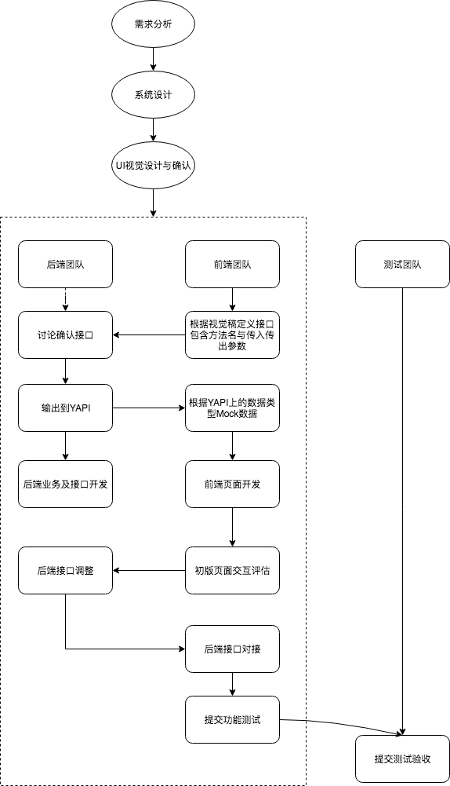

# 前后端协作流程

前端是Web的一个细分领域, 往往不能脱离后端而存在。 并且与后端协作的时间是最长的。

## 协作流程规范

前后端团队经过长期的合作，一般可以总结出一条对于双方开发效率最优的协作流程，将这个落实为规范，后面的团队成员都遵循这个步骤进行协作

一个典型的前后端协作流程如下:

1. `需求分析`, 参与者一般有前后端、测试、产品经理等, 一般由产品主持, 对需求进行讲解，并接受开发和测试的反馈，确保大家对需求有一致的认知
2. `前后端开发讨论`, 待系统设计与原型、视觉等出来后。 前后端一起讨论应用中的一些开发设计，沟通技术点、难点以及分工问题
3. `设计接口文档`, 前端根据原型与视觉，初步确定所需的接口及传入参数类型。交付后端同学后，在一起确认返回数据类型与结构, 后端同学将接口信息维护到Swagger或Yapi等接口管理平台上
4. `前后端并行开发`, 在此阶段，前端根据接口管理平台文档Mock数据模拟接口对接开发页面，后端进行业务处理以及接口开发。
5. `前端页面交互评估`, 此阶段，可以在项目组内对页面效果进行评估, 如果页面效果达不到要求，及时反馈给UI进行重新设计，如涉及后端接口调整则后端配合修改修改
6. `前后端联调`, 在后端接口做好测试的情况下，前端将Mock地址切换成后台接口地址，进行联调测试
7. `提交测试`, 前后端联调完成后, 提交功能测试

## 接口规范

首先应该确定下来的是接口规范, 最好能够统一规范，满足前后端开发效率要求

建议采取[RESTFul](http://www.ruanyifeng.com/blog/2018/10/restful-api-best-practices.html)

## 接口文档规范

后端通过接口文档向前端暴漏接口相关的信息，通常需要包含这些信息: 

+ 版本号
+ 文档描述
+ 服务的入口，例如接口请求路径
+ 测试服务器
+ 安全与认证
+ 具体接口定义
  - 方法名称或者URL
  - 方法描述
  - 请求参数及其描述，必须说明类型(数据类型、是否可选等)
  - 响应参数及其描述, 必须说明类型(数据类型、是否可选等)
  - 可能的异常情况、错误代码、以及描述
  - 请求示例，可选

::: warning
如果人工维护的文档，往往会导致代码与文档不同步问题

如果可以从代码或者规范文档中生成接口文档，可以解决实现和文档不一致的问题，同时也减少文档编写和维护的成本
:::

## 接口测试与模拟

为了做到高效率的前后端并行开发，接口的测试和模拟必不可少

+ 前端要求后端在联调之前，需要测试验证好自己的接口是否可以正常工作。而不是在联调期间，把前端当‘接口测试员’，阻塞接口联调进度
+ 前端需要在后端接口未准备好之前，通过接口模拟的方式，来编写业务逻辑代码

前端可使用(Yapi)[http://yapi.adc.com]提供的Mock Server进行数据模拟