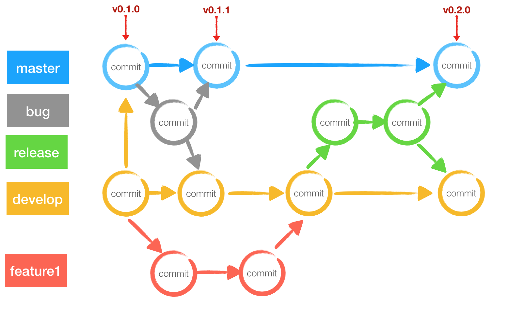
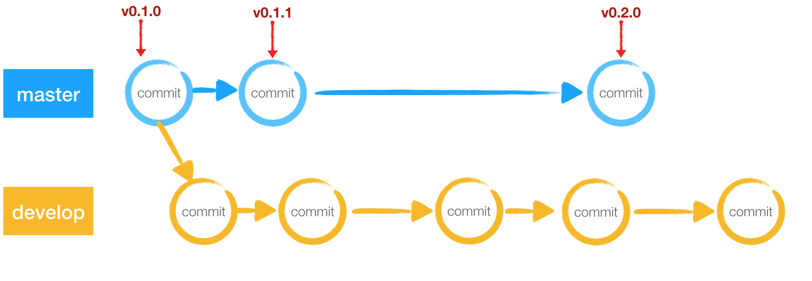
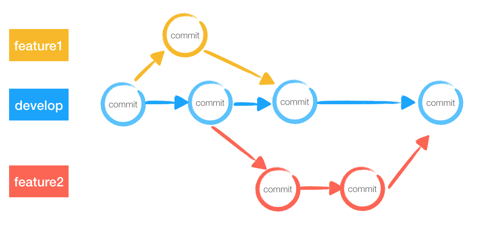
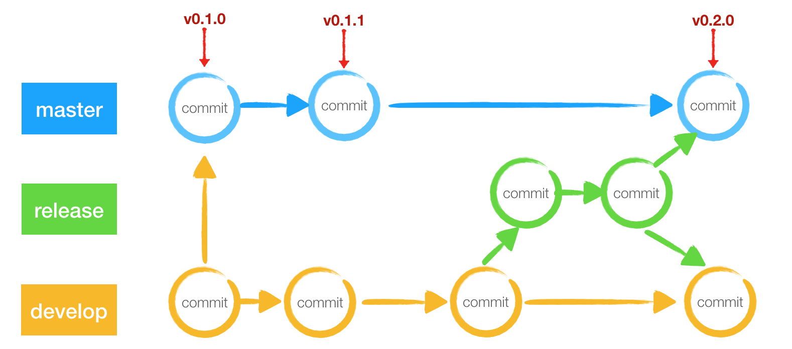
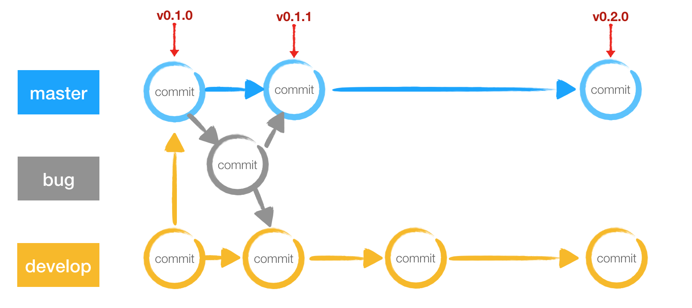

# Git-Flow工作流规范

大部分的团队都使用git作为版本库, 在涉及到多人协作，需要管理多个软件版本的情况下，定义良好的版本管理规范，可以让大型项目更有组织性，也可以提高成员协作效率

这里我们采取`Git-Flow`作为我们git工作流规范

`Git-Flow` 工作流定义了更为严格的分支模型。定义了各种分支的`职责`和`使用场景`以及`生命周期`




## 分支定义

### 历史分支



`Git-Flow`使用了两个分支来记录项目的历史记录，即`master`分支和`develop`分支。 `历史分支`是相对于`临时分支`而言的，`临时分支`有`功能分支`、 `修复分支`和`发布分支`，`发布分支`在发布完成后即会被删除

* `master` 这是一个稳定的分支, 又称为保护分支， 表示正式发布的历史, 所有对外正式版本发布都会合并到这里, 并打上版本标签。
* `develop` 开发分支用来整合功能分支， 表示最新的开发状态。等价于功能分支工作流的`master`分支

> 注意每次合并到`master`都要打上`tag`, 方便定位

#### tag规范

`v{APP_version}` 例如 v1.0.1 版本遵循 版本规范

### 功能分支

`功能分支`是从`开发分支`中分叉出来的, 当新功能完成后，再合并回`开发分支`



#### 功能分支命名规范

* feature/${name}  name为功能名称, 例如搜索模块 `feature/search`
* feature/${dev_name}_${date} dev_name为开发着姓名，采取统一小些字母，date为分出分支的日期，以MO门户为例 `feature/chenhang_20190916`, 增加日期名也为防止同时分出多个功能分支开发

#### 合并规范

当feature分支迭代稳定，并自测通过后，发起Pull Request，项目负责人进行代码Review后合并到develop中，此时feature分支的生命周期就结束了，后续Bug修复从develop分支拉取代码


### 发布分支

一旦到了发布分支， 比如`开发分支`积累到足够的功能或者到了指定的发布日期, 就从`开发分支`上分叉出来一个`发布分支`, 开始`发布循环`, 后续新的功能也不会加到这个分支，此分支只当作Bug修复，文档生成和其他面向发布的任务



当`发布分支`稳定到足以合并到`master`的时候，`发布分支`的生命周期也结束了，这时候我们将稳定的发布分支合并到`master`分支，然后打上 `tag` 版本号；接着还需要将`发布分支`合并回`开发分支`

::: tip
该不该保留发布分支？
你可以删掉它，因为在 master 上打了 tag，即使你删掉了发布分支，你也可以很方便的重新创建一个:
```sh
# 基于tag v1.0. 0创建一个分支
$ git checkout -b release/v1.0.0 v1.0.0
```
:::

### bug修复分支

`修复分支`主要职责是快速给`生成版本`打补丁，这些Bug可能比较紧急，而且跨越多个分支，我们通过新建一个`补丁分支`, 快速修复`master`上的bug, 然后合并到`master`分支和`开发分支`，并重新为`master`分支打上tag



## 示例

以[`MO门户`](http://gitlab.adc.com/oppo-front/new-mo-portal.git)为例

MO门户开发流程
1. 从`develop`分支分出`feature`分支，分支命名参考`功能分支-功能分支命名规范`。
2. 在`feature`分支开发完成功能并自测通过后，提交到远程`feature`分支，并向`develop`分支发起合并请。
3. 由项目负责人review代码，并确认后合并到`develop`分支, 如果代码不符合规范或有明显错误，关闭合并请求，由功能分支开发负责人修改自测后再提交合并请求
4. 当代码合并到`develop`分支，此功能分支生命周期结束。此功能模块开发阶段完成 

MO门户测试环境发布流程：
1. 从`develop`分支分出`release`分支，以`release-${version}`作为分支名作为发布分支
2. 修改测试环境配置，打包发布测试环境
3. 如果修复此版本BUG，从`release`分支分出`fix`分支进行BUG修复

MO门户正式环境发布流程：
1. 当`release`版本稳定后，就可以用此版本打包正式环境发布，并将此代码合并到`master`分支，并在`master`分支根据当前版本打上Tag
2. 将`release`分支合并到`develop`分支中，此分支保留只做正式环境紧急BUG修复
3. 当正式环境出现需要紧急修复的BUG时, 从此分支上分出修复分支，修复完成打包发布后，将代码合并到`master`分支和`develop`分支


## Git提交信息规范

一个好的提交信息, 会帮助你提高项目的整体质量

+ Why
  
  - 格式统一的提交信息可以帮助自动化生成Changelog
  - 版本库不只是存放代码的仓库, 也记录项目的开发记录. 这些记录应该可以帮助后来者快速地学习和回顾代码. 也应该方便其他协作者review你的代码

+ 必要信息

  * 为什么要进行这次提交？
    - 提交改变了什么, 让其他reviewer更容易审核代码和忽略无关的改变
  * 如何解决的问题?
    - 问题是什么原因引起的
    - 简短说明使用什么方式，策略修复了问题
  * 变化可能影响哪些地方
    - 说明变动功能的细节

### 格式

采用angular的提交规范，在这个规范的基础上支持`emoji`进行修饰

```sh
<type>(<score>): <subject>

<body>

<footer>
```

#### header

+ type: 说明commit的类别，可以配合emoji使用，类型如下：
  - <b>featrue</b>: 引入新功能
  - <b>fix</b>: 修复bug
  - <b>docs</b>: 文档
  - <b>style</b>: 优化了项目结构或者代码格式
  - <b>test</b>: 增加测试
  - <b>refactor</b>: 代码重构，代码重构不涉及新功能和Bug修复，不影响原有功能
  - <b>chore</b>: 构建过程，辅助工具升级，如增加依赖，升级构建工具
  - <b>perf</b>: 性能优化
  - <b>revert</b>: revert之前的commit
  - <b>build或release</b>: 构建或发布版本
  - <b>safe</b>: 修复安全问题
+ scope: 可选，说明提交影响的范围，例如样式，后端接口，逻辑层
+ subject: 提交目的的简短描述，动词开头

#### body

可选，对本次提交的详细描述，如果变动很简单，可以省略

#### footer

可选，只用于说明不兼容变动或关闭Issue

  


