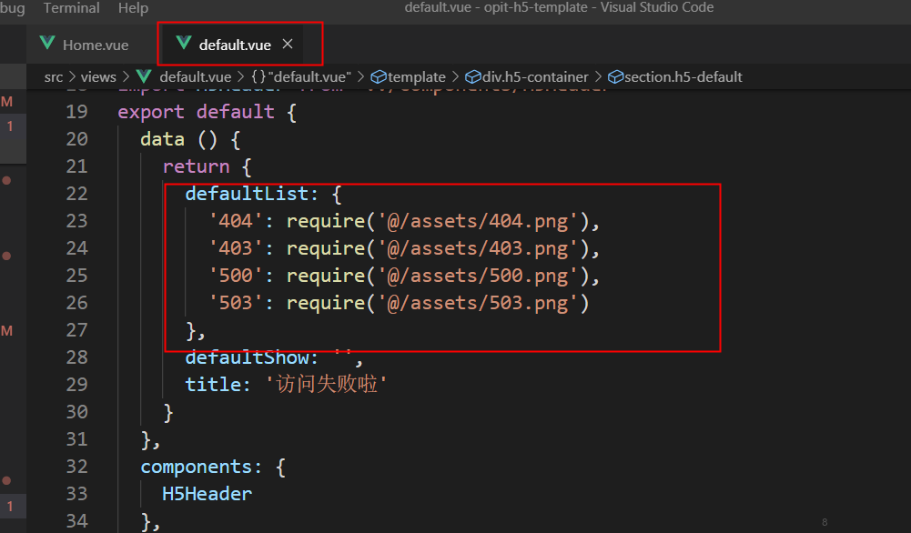
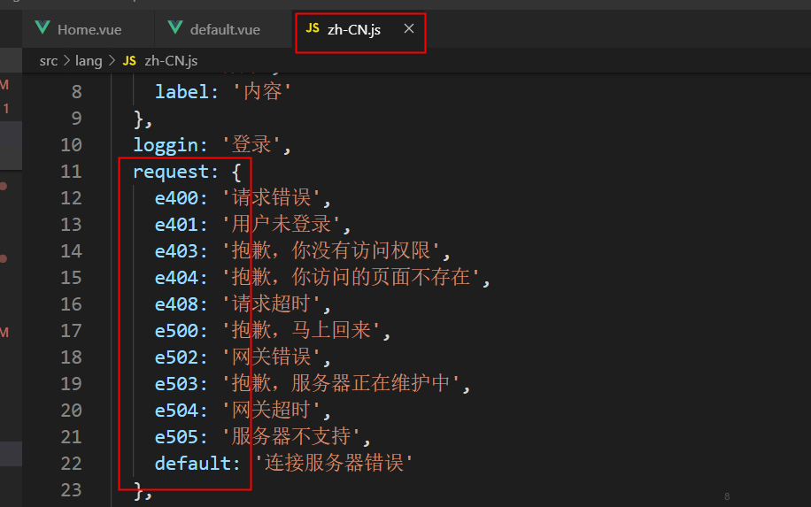

# 移动端开发

## 目录结构
基于[基础-目录结构](/guide/common.html#%E7%9B%AE%E5%BD%95%E7%BB%93%E6%9E%84)增加
```sh
├── src
│   └── cube-ui.js  # cube组件统一引用文件 
    
```

## 基础依赖

### Cube-UI
`cube-ui` 为基于 `Vue.js` 实现的移动端组件库，由滴滴团队开发维护。

#### 调用
支持 `全部引入` 及 `按需引入`，我们当前采用 `按需引入`
1. 在文件 `cube-ui.js`（src目录下）,引入需要用到的组件及模块
``` js
// 以Button为例
import {
  Button
} from 'cube-ui'
```

2. 全局注册引入的组件及模块
``` js
Vue.use(Button)
```
> 按需引入，不会打包基础样式部分的，所以在使用的时候需要引入 `style` 模块（已引入）

3. 组件调用

    3.1 基本调用（以Button为例）
    ``` html
    <template>
      <cube-button>show dialog</cube-button>
    </template>
    ```
    3.2 API调用 （主要为底层弹层组件，以dialog为例）
    ``` html 
      <cube-button @click="showAlert">Dialog - alert</cube-button>
      <script>
        export default {
          methods: {
            showAlert() {
              this.$createDialog({
                type: 'alert',
                title: '我是标题',
                content: '我是内容'
              }).show()
            }
          }
        }
      </script>
    ```
    3.3 在普通js中或者全局调用
    ``` js
    import Vue from 'vue'
    import { Dialog } from 'cube-ui'

    Vue.use(Dialog)  // 如果已经进行过全局注册的组件，可以不用再次注册

    Dialog.$create({
      ...
    })
    ```
#### 组件

+ 基础组件`button`, `loading`, `tip`, `tarBar`等,表单组件`input`, `checkbox `, `checkboxGroup`, `switch`, `select`等。调用时，采用基础调用方式，直接编写`<cube-xxx></cube-xxx>`，调用cube-ui组件，详细配置可参考[官方文档](https://didi.github.io/cube-ui/#/zh-CN/docs/button)
+ 弹出层组件`Popup`, `Toast`, `Picker`, `TimePicker`, `Dialog`等，该类型组件基于`create-api`实现，推荐使用API调用方式`this.$createXxx({})`。[详细配置](https://didi.github.io/cube-ui/#/zh-CN/docs/popup)
+ 滚动组件`scroll`, `slide`, `indexList`, `swipe`, `scrollNav`等，该类型组件基于`better-scroll`封装，调用方式查看[具体示例](https://didi.github.io/cube-ui/#/zh-CN/docs/scroll)

#### 模块
#### *style*

style 模块主要包含就是样式部分，包含内置 icon、基础的 reset 以及基础通用样式。

- 图标是利用 `font-face` 规则自定义字体 "cube-icon" 实现的。使用的时候只需要加入对应的类名即可。内置 icon 有 [65 个](https://didi.github.io/cube-ui/#/zh-CN/docs/style)。

``` html
// 例如alert图标
<i class="cubeic-alert"></i>
```

- `base.css`主要包含的就是 `html`, `body` 元素的 `font-family`, `line-height` 等的设定，修正浮动影响的 `.clear-fix`，以及上下左右四个边框的绝对 `1px` 边框的 class：`.border-top-1px`, `.border-right-1px`, `.border-bottom-1px`, `.border-left-1px`。

#### *create-api*

该模块默认暴露出一个 `createAPI` 函数，可以实现以 API 的形式调用自定义组件。并且既可以在 Vue 实例上下文中调用，也可以在普通 js 文件中调用。
>所有通过 `createAPI` 实现的通过 API 的形式调用的自定义组件（cube-ui 内置的组件）都需要通过 `Vue.use` 注册才可以。

**createAPI(Vue, Component, [events, single])**

参数：
  - `{Function}Vue`：Vue函数
  - `{Function|Object}Component`: Vue组件，组件必须有Name
  - `{Array}[events]`: 组件实例emit的事件名集合
  - `{Boolean}[single]`: 是否为单例

用法：

  该方法在 Vue 的 prototype 上增加一个名为 `$create{camelize(Component.name)}` 的方法，这样就可以在其他组件中直接通过 `const instance = this.$createAaBb(config, [renderFn, single])` 这样来实例化组件了，而且这个实例化组件的元素是被附加到 `body` 元素下的。

  `const instance = this.$createAaBb(config, renderFn, single)`

  &emsp;**配置参数`config`：**
  
  &emsp;&emsp;默认所有的值都会当做 props，但是要排除 createAPI 传入的 `events` 中的事件（默认会做转换，例如：`events` 的值为 `['click']`，那么 `config` 中的 `onClick` 就是作为 `click` 事件的回调函数，而不是作为 `props` 传递给组件）。
  ```js
  createAPI(Vue, Component, ['click'], true)

  this.$createAaBb({
    content: 'My Component Content',  // 组件props参数
    onClick(e): {     // 时间click的回调函数
      console.log('click')  
    }
  })
  ```

   &emsp;&emsp; 1.10.0版本以后 config 中可以设置 Vue 支持的所有的[配置值](https://cn.vuejs.org/v2/guide/render-function.html#%E6%B7%B1%E5%85%A5%E6%95%B0%E6%8D%AE%E5%AF%B9%E8%B1%A1)，但是必须要加 `$`
  ```js
    this.$createAaBb({
      $attrs: {
        id: 'id'
      },
      $class: {
        'my-class': true
      }
    })
  ```

  `$prop`，`$event`配置说明（1.8.0版本之后就支持）：

  - `$prop`中的值是响应式的，自动监控当前实例化上下文（即 this.$createXx 中的 this）的上对应的属性值。约定结构 `{ [key]: [propKey] }`,获取对应的`propKey`值传递给组件的Props。
  ```json
    {
      title: 'title',
      content: 'my content',
      open: false
    }
    // title、content、open 就是传递给组件的 Prop 的 key，而对应 Prop 的值则按照如下规则获取：
    // 1. 如果是非字符串，则直接取配置的 propKey 作为值
    // 2. 如果是字符串，且配置的 propKey 不在当前实例上下文属性上，则直接取 propKey 作为值
    // 3. 是字符串，且在当前实例上下文属性上，那么直接获取当前实例上下文对应的 propKey 的值，且会监控这个值的变化实时更新到组件实例上
  ```
  - `$events`组件的 Events 事件回调，约定结构 { [eventName]: [eventValue] }：
  ```json
    {
      click: 'clickHandler',
      select: this.selectHandler
    }
    // click、select 就是事件名，而对应的事件回调则按照如下规则获取：
    // 1. 如果 eventValue 是非字符串，则直接取配置的 eventValue 作为值
    // 2. 如果 eventValue 是字符串，则直接获取当前实例上下文对应的 eventValue 的值
  ```
  &emsp;**renderFn**：

  &emsp; &emsp;可选参数(Function)，用于生成子 VNode 节点，一般场景是处理 slot
  ```js
  function (createElement) {
    ...
  }
  ```
  &emsp; &emsp;**single**

  可选参数，创建的时候决定是否是单例的，优先级更高，如果没有传入 renderFn 的话，single 的值就是第二个参数的值
  
  &emsp;**返回值 `instance`**：

  `instance` 就是组件实例。

  >这个实例会被附加或代理 remove 方法

  &emsp; &emsp;如果调用了，该实例就会被销毁且会从 body 下移除。

  &emsp; &emsp;如果说实例化上下文（即 this.$createXx 中的 this）销毁的话会自动移除销毁该实例元素。

**完整示例**：
1. 定义一个vue组件 Hello.vue
```html
// Hello.vue
<template>
  <div @click="clickHandler">
    {{content}}
    <slot name="other"></slot>
  </div>
</template>

<script type="text/ecmascript-6">
  export default {
    name: 'hello',
    props: {
      content: {
        type: String,
        default: 'Hello'
      }
    },
    methods: {
      clickHandler(e) {
        this.$emit('click', e)
      }
    }
  }
</script>
```
2. 通过 `createAPI` 把 `Hello.vue` 变成一个 API 式调用的组件
```js
// cube-ui.js
import Vue from 'vue'
import Hello from './Hello.vue'

import {
  createAPI
} from 'cube-ui'

// 创建 this.$createHello API
createAPI(Vue, Hello, ['click'], true)
```
3. 组件内调用
```html
<template>
  <div @click="showHello"></div>
</template>
<script>
export default {
  methods: {
    showHello(){
      // 直接调用
      // 传入配置对象，默认传入的所有对象全都当做 props 传入组件
      // 除了在调用 createAPI 的时候传入了 events，这里对应的就是on{event name} 会被当做事件回调处理
      const instance = this.$createHello(
        {
          content: 'My Hello Content',  // props
          onClick(e) {   // events，事件'click'
            console.log('Hello component clicked.')
          }
        }, 
        // 此处config参数，也可用带`$`的vue配置项定义
        /**
        {
          $props: {
            content: 'My Hello Content',  // props
          },
          $events:{
            click(){
              console.log('Hello component clicked.')
            }
          }
        }
        */
      /* renderFn */ 
        (createElement) => {
          return [
            createElement('p', {
              slot: 'other'
            }, 'other content')
          ]
        }
      )

      // 销毁实例
      // instance.remove()
    }
  }
}
</script>
```

4. 在普通js或全局调用
```js
Hello.$create(config, renderFn)
```

#### *better-scroll*

`better-scroll` 的滚动原理为：在滚动方向上，第一个子元素的长度超过了容器的长度

该模块默认暴露出一个 `BetterScroll` 函数对象，这个对象直接从依赖库 `better-scroll` 获得。

[官方文档](https://ustbhuangyi.github.io/better-scroll/doc/zh-hans/#better-scroll%20%E6%98%AF%E4%BB%80%E4%B9%88)

### Stylus
stylus为css预处理框架

#### 1. `styuls`书写
冒号，分号，逗号，括号均可选。开发过程中为保证项目风格统一，均不省略。遵循[css书写规范](/guide/developmentStandard/css.html#_2-%E4%BB%A3%E7%A0%81%E9%A3%8E%E6%A0%BC)
```css
body {
  background: #19cbab;
  color: #fff;
}
```
#### 2. 选择器

  2.1 规则集，和CSS一样，允许你使用逗号为多个选择器同时定义属性
  ```css
    textarea,
    input {
      border: 1px solid #eee;
    }
  ```
  2.2 父级引用。字符`&`指向父选择器
  ```css
  textarea,
    input {
      color: #A7A7A7;
      &:hover {
        color: #000;
      }
    }
    /* 等同于 */
  textarea,
    input {
      color: #a7a7a7;
    }
  textarea:hover,
  input:hover {
    color: #000;
  }
  ```
#### 3. 变量
  3.1 可以指定表达式为变量，然后在样式中贯穿使用，标识符（变量名，函数等），可以包含`$`符
  ```css
    font-size = 14px
    $color = #333
    body {
      font: font-size Arial, sans-seri;
      color: $color;
    }
    /* 等同于 */
    body {
      font: 14px Arial, sans-seri;
      color: #333;
    }
  ```
  3.2 属性查找：可以前置@字符在属性名前来访问该属性名对应的值。
  ```css
    #logo {
      position: absolute;
      top: 50%;
      left: 50%;
      width: 150px;
      height: 80px;
      margin-left: -(@width / 2);
      margin-top: -(@height / 2);
    }
  ```
  >属性会“向上冒泡”查找堆栈直到被发现，或者返回null
  ```css
    /* @color为blue */
    body {
      color: red;
      ul {
        li {
          color: blue;
          a {
            background-color: @color;
          }
        }
      }
    }
  ```
#### 4. 插值

  4.1 Stylus支持通过使用`{}`字符包围表达式来插入值，其会变成标识符的一部分。例如，-webkit-{'border' + '-radius'}等同于-webkit-border-radius。
  ```css
    vendor(prop, args) {
      -webkit-{prop}: args;
      -moz-{prop}: args;
      {prop}: args;
    }
    
    border-radius() {
      vendor('border-radius', arguments)
    }

    button {
      border-radius: 1px 2px / 3px 4px;
    }
    
    /* 等同于 */
    
    button {
      -webkit-border-radius: 1px 2px / 3px 4px;
      -moz-border-radius: 1px 2px / 3px 4px;
      border-radius: 1px 2px / 3px 4px;
    }
  ```
  4.2 插值也可以在选择器上起作用
  ```css
    table {
      for row in 1 2 3 4 5 {
        tr:nth-child({row}) {
          height: 10px * row
        }
      }
    }

   /* 等同于 */

    table tr:nth-child(1) {
      height: 10px;
    }
    table tr:nth-child(2) {
      height: 20px;
    }
    table tr:nth-child(3) {
      height: 30px;
    }
    table tr:nth-child(4) {
      height: 40px;
    }
    table tr:nth-child(5) {
      height: 50px;
    }
  ```
#### 5. 方法
Stylus强大之处就在于其内置的语言函数定义。其定义与混入(mixins)一致；却可以返回值。

  5.1 返回值
  ``` css
    /* 方法 */
    add(a, b) {
      a + b
    } 

    /* 调用 */
    body {
      padding: add(10px, 5)
    }

    /* 渲染 */
    body {
      padding: 15px;
    }
  ```
  5.2 默认参数
  ```css
    add(a, b = a){
      a + b
    }

    add(10, 5)
    /* => 15 */

    add(10)
    /* => 20 */
  ```
  5.3 函数体
  
  我们可以把简单的`add()`方法更进一步。通过内置`unit()`把单位都变成`px`, 因为赋值在每个参数上，因此，我们可以无视单位换算
  ```css
    add(a, b = a) {
      a = unit(a, px)
      b = unit(b, px)
      a + b
    }

    add(15%, 10deg)
     /* => 25 */
  ```
  5.4 多个返回值

  Stylus的函数可以返回多个值，就像你给变量赋多个值一样
  ```css
    swap(a, b) {
      return b a
    }
  ```
  5.5 条件

  比如：我们想要创建一个名为stringish()的函数，用来决定参数是否是字符串。我们检查val是否是字符串或缩进（类似字符）。如下，使用yes和no代替true和false
  ```css
    stringish(val) {
       if val is a 'string' or val is a 'ident' {
        yes
       } else {
        no
       }
    }
     
    /* 使用 */
    stringish('yay') == yes
    /* => true */
 
  ```
  5.6 参数
  `arguments`是所有函数体都有的局部变量，包含传递的所有参数。
  ```css
    sum() {
      n = 0
      for num in arguments
        n = n + num
    }

    sum(1,2,3,4,5)
    /* => 15 */
  ```
#### 6. 注释
Stylus支持三种注释，单行注释，多行注释，以及多行缓冲注释。
``` stylus
// 单行注释

/*
* 多行注释
*/

/*!
 * 多行缓存注释
 * 跟多行注释类似，不同之处在于开始的时候，这里是/*!. 这个相当于告诉Stylus压缩的时候这段无视直接输出。
 */
body {
  padding: 5px;
}
```
#### 7. 内置方法
- abs(unit) 绝对值
- ceil(unit) 向上取整
- floor(unit) 向下取整
- min(a, b) 取较小值
- max(a, b) 取较大值
- even(unit) 是否为偶数
- sum(nums) 求和
- [.....](http://stylus-lang.com/docs/bifs.html)

#### 8. 导入（import）
 8.1 Stylus支持字面`@import` CSS, 也支持其他Stylus样式的动态导入
 ```css
 @import "reset.css"
 ```
 8.2 当使用`@import`没有.css扩展，会被认为是Stylus片段（如：@import "mixins/border-radius"）。
 
 8.3 `@import`也支持索引形式。这意味着当你@import blueprint, 则会理解成blueprint.styl或blueprint/index.styl. 

**[官方文档](http://stylus-lang.com/)** 

## 功能

### Http
http请求基于[Axios](https://www.kancloud.cn/yunye/axios/234845)实现，文件：`src/utils/request.js`
#### 实现
1. `create` 新建实例，初始化url，timeout等。当前定义超时时间为`20000`，可根据实际项目更改`VUE_APP_HTTP_TIMEOUT`的值，来更改统一的超时时间。也可以通过定义接口参数`timeout`，更改当前接口的超时时间。
```js
// 实例化axios
const env = process.env

const httpRequest = axios.create({
  baseURL: env.VUE_APP_BASE_URL, // 请求地址，请求路径: baseURL+url
  timeout: env.VUE_APP_HTTP_TIMEOUT // 超时时间
})
```
> 参数配置，定义在全局环境变量文件.env中
2. `interceptors.request.use` 请求前拦截处理，可以根据实际项目添加请求头处理
```js
httpRequest.interceptors.request.use(
  config => {
    let token = Cookie.get(env.VUE_APP_TOKEN_KEY)  // 获取token参数值，VUE_APP_TOKEN_KEY为token存在本地的字段参数
    if (token) { // 若token存在且项目中的接口需要验证token，则统一在http请求的header都加上token信息
      // TODO token请求头添加
      // 如下。开发过程中，实际字段根据前后端协议来定义。同时根据协议添加其他需要在接口头部传送的其他参数
      config.headers['X-Token'] = token
      config.headers['LANG'] = 'zh'
    } else {
      // token失效处理
      tokenFailure()   // 内部方法，定义需要验证token时，未获取到tonken信息时的处理逻辑
    }
    Loading.show()
    return config
  },
  error => {
    return errorHandelr(error)  // 内部方法，定义请求发送失败时的处理逻辑
  }
)
```
3. `interceptors.response.use` 响应拦截器处理

    3.1. 接口成功，`responseHandler` 方法中根据实际项目定义接口自定义状态码code处理
  
    3.2. 接口失败

      - http状态码处理

      - 超时重试处理，`VUE_APP_RETRY_COUNT`设置重试次数，当前为`1`，即发生超时，自动重新发起接口请求1次。设为`0`,则不进行重试。`VUE_APP_RETRY_DELAY`设置接口超时之后多久发起重试。
    ```js
    let __retryCount = 0

    // 添加响应拦截器
    httpRequest.interceptors.response.use(
      response => {
        const res = response.data
        if (res && res.message === env.VUE_APP_SUCCESS_CODE) {  // 根据接口返回信息状态判断是否获取数据成功
          Loading.hide()    
          return res.data   // 成功，返回接口数据，用于业务逻辑处理
        } else {
          let err = responseHandler(res)  // 失败，根据接口状态码协议，组装错误信息
          return errorHandelr(err)    // 内部方法，抛出错误信息
        }
      },
      error => {
        if (error) {
          let config = error.config
          // 判断是否需要重试，不需要直接抛出异常
          if (!shouldRetry(error)) {  // shouldRetry 根据错误码判断是否因为超时导致的接口失败
            return errorHandelr(error)
          }

          if (__retryCount >= env.VUE_APP_RETRY_COUNT) {
            return errorHandelr(error)
          }

          // 重试次数自增长
          __retryCount += 1

          // 延时处理
          var backoff = new Promise(function (resolve) {
            setTimeout(function () {
              resolve()
            }, env.VUE_APP_RETRY_DELAY || 1)
          })

          // 重试，重新发起axios请求
          return backoff.then(function () {
            return httpRequest(config)
          })
        } else {
          return errorHandelr(error)
        }
      }
    )
    ```
4. 方法定义
    
    4.1 `tokenFailure`: 无token信息或token失效，逻辑处理
    
    4.2 `responseHandler`: 接口请求成功，但数据获取失败，根据接口状态码定义对应的处理逻辑

    4.3 `errorHandelr`：根据错误信息，抛出异常，提示或跳转缺省页等
5. 配置参数定义

http请求方法用的到部分常量参数，定义在`.env`中，实际开发过程中，可根据实际项目协议，更改参数值
```sh
// HTTP参数
VUE_APP_BASE_URL = 'http://172.16.44.214:8080' // 请求路径
VUE_APP_HTTP_TIMEOUT = 20000  // 超时时间
VUE_APP_TOKEN_KEY = 'Admin-Token' // token存储参数
VUE_APP_SUCCESS_CODE = 'OK'  // 接口成功状态码
VUE_APP_RETRY_COUNT = 1  // 重试次数
VUE_APP_RETRY_DELAY = 1000  // 重试延时
```

#### 使用
`/api`目录下定义接口数据,可直接调用`request`传参，定义接口访问。业务开发过程中，直接调用`api`方法，`catch`处理接口成功逻辑处理，`then`定义接口失败逻辑处理

参数说明：

`url`: 接口路径

`method`: 接口请求方式 

`data`: 接口请求传参

> 其他参数可以根据实际情况参考axios参数进行重写。
```js
// 以登录接口为例
// api/index.js
export function loggin (data) {
  return request({
    url: '/syvcm/app/loggin',
    method: 'post',
    data: data
  })
}

// app.vue
import { loggin } from '../api/index.js'
export default {
  method: {
    loggin () {
      let data = {}
      loggin(data).then(res => {
        // 成功逻辑处理
      }).catch(err => {
        // 失败逻辑处理
      })
    }
  }
}
```

### 国际化
采用cube-ui自身的国际化组件。cube-ui默认使用中文语言包，并且已经注册了。

国际化定义实现目录 `src/lang`,目前仅支持中英文，实现其他语言需要自己定义组件语言包。


#### 实现

1. `index.js` 语言包引入，语言切换，使用等方法实现
2. `default.js` cube-ui默认提供的语言包配置，若需要实现除中英文外的其他语言，则需要根据该文件配置翻译对应的语言包。以此实现cube-ui提供的组件的语言切换。
3. `en-US.js` 英文语言包，集成`cube-ui`提供的英文语言包`cube-ui/src/locale/lang/en-US`,定义开发过程中文案对应的英文语言，以`json`格式定义
4. `zh-CN.js` 中文语言包，集成`cube-ui`提供的英文语言包`cube-ui/src/locale/lang/zh-CN`,定义开发过程中文案对应的中文语言,以`json`格式定义

#### 使用

**1. 文案编写**
  
语言包中定义文案对应参数，组件或js中读取该参数

  1.1 组件内使用，已全局注册，直接使用转换函数`$t`
  ```js
  // 语言包定义
  export default {
    title: '这就是标题'，
    alertContxt: {
      txt: '我知道了'
    }
  }
  // 使用
  <template>
    <header>{{$t('title')}}</header>
    <div>{{$t('alertContxt.txt')}}</div>    // 使用'.'分隔符的字符串，获取深层次的属性
  </template>
  ```
  1.2 在普通js中或者全局调用。由于`$t`函数是通过组件的`mixins`属性全局注入的，故只能在组件中实现调用。在普通js中无法识别该函数。因此，我们在`index.js`中，重新定义了`$t`函数，可在其他文件中引入。
  ```js
  // helloWorld.js
  import { $t } from '../lang/index'  //相对路径

  console.log($t('alertContxt.txt')) // 我知道了
  ```
**2. 语言切换**

  2.1 中英文语言切换，直接调用`$toggleLang`，实现自动获取当前语言，更改语言为另外一种语言（中文，英文相互切换）
  ```html
  <cube-button :inline="true" @click="$toggleLang">中英文切换</cube-button>
  ```
  2.2 多语言切换，调用`$changeLang(lang)`,`lang`为语言类型，则切换为对应语言
  ```html
  <cube-button :inline="true" @click="$changeLang('zh-cn')">切换为中文</cube-button>
  ```
  > index.js中对象`messages`的键值对定义语言类型与语言包的对应关系，在调用多语言切换时需要保持参数`lang`与该对象中的属性类型对应，否则不能识别对应语言包
  ```js
  export const messages = {
    'zh-cn': zhLocale,
    'en-us': enLocale
  }
  $changeLang('zh-cn')  // 若参数为zh，则不能识别
  ```
  
### TT工作台接入
TT工作台跳转，携带`tt_token`及`tt_control`，在顶层路由文件`App.vue`中，加载之后，获取当前`tt_token`及`tt_control`，登录验证，验证参数是否有效。验证成功，获取登录信息。

### 缺省页
**定义**

`views/defaulr.vue` 根据不同的状态码加载对应的图片及提示语。为保证多语言功能，提示语定义在语言包文件中




**调用**

路由跳转
```js
import router from '../router/index'
router.push({
  path: '/default',
  query: {
    code: errCode    // errCode 状态码
  }
}) 
```

### 主题

#### 自定义主题
1. 主题开发

    `src/theme/theme.styl`为`cube-ui`提供的默认主题，若想要自定义主题，需要重新定义文件，替换默认主题样式

    1.1 `src/theme`下主题文件`icommTheme.styl`，同`theme.styl`内容一致（可只定义其中部分变量）

    1.2  `src/theme`下主题变量定义文件`icommVar.sty`，定义基本颜色，字体等
    ```stylus
    // icommVar.styl
    $brand-color = #009b52   // 主题色
    $brand-active-color = #018748 // 选中
    $brand-color-opacity = rgba(39, 155, 1, .08)
    ```
    1.3  `icommTheme.styl`文件引用文件`icommVar.styl`定义的变量,使用文件中的变量替换原有样式
    ```stylus
    // 截取部分示例，以按钮背景色为例
    //原theme.js文件
    $btn-bgc := $color-regular-blue
    $btn-bdc := $color-regular-blue
    $btn-active-bgc := $color-blue
    $btn-active-bdc := $color-blue

    // 自定义样式icommTheme.styl
    $btn-bgc := $brand-color
    $btn-bdc := $brand-color
    $btn-active-bgc := $brand-active-color
    $btn-active-bdc := $brand-active-color
    ```
    1.4 在主题文件中增加开发中的共有样式变量，在组件开发过程中可直接引用该变量
    ```stylus
    // 文件icommTheme.styl
    // common
    $bg-color := $brand-color
    
    // Home.vue
    header 
      background-color: $bg-color
    ```
2. 主题配置

`vue.config`配置`sylus`引入当前主题
```js
// vue.config.js
css: {
  loaderOptions: {
    stylus: {
      'resolve url': true,
      'import': [
        './src/theme/icommTheme' // 定义的主题文件路径
      ]
    }
  }
}
```
3. 编译生成当前主题样式的代码。该主题定义的方式，直接是对组件样式的变量做的修改，而不是采用传统的样式覆盖,这样不会存在样式冗余覆盖的问题。

#### 多主题
借助于 `CSS` 自身支持的[变量（自定义属性）](https://developer.mozilla.org/zh-CN/docs/Web/CSS/--*)，改变`css`变量，实现主题颜色切换
1. 实现
  
    1.1 `src/theme/multi/multiVar.styl`使用`css`变量定义`stylus`变量
    ```css
    :root {
      --brand-color: #009b52   // 主题色
      --brand-active-color: #018748   // 选中
      --brand-color-opacity: rgba(39, 155, 1, .08)
    }
    ```
    1.2 `src/theme/multi/multiTheme.styl`引用文件`multiVar.styl`定义的变量,使用文件中的变量替换原有样式
    > 因为引用了`css变量`，使用变量时调用`var()`函数
    ```stylus
    // 截取部分示例，以按钮背景色为例
    //原theme.js文件
    $btn-bgc := $color-regular-blue
    $btn-bdc := $color-regular-blue
    $btn-active-bgc := $color-blue
    $btn-active-bdc := $color-blue

    // multiTheme.styl
    $btn-primary-bgc = var(--brand-color)
    $btn-primary-bdc = var(--brand-color)
    $btn-primary-active-bgc = var(--brand-active-color)
    $btn-primary-active-bdc = var(--brand-active-color)
    ```
    1.3 在主题文件中增加开发中的共有样式变量，在组件开发过程中可直接引用该变量
    ```stylus
    // multiTheme.styl
    // common
    $bg-color = var(--brand-color)
    
    // Home.vue
    header 
      background-color: $bg-color
    ```
    1.4 `src/theme/multi/multiData.js` 定义多种主题颜色对应的数据，定义切换主题方法`changeTheme`
    ```js
    let theme1 = {
      '--brand-color': '#009b72',
      '--brand-color-active': '#009b52',
      '--brand-color-opacity': 'rgba(0,155,114,.08)'
    }   // 主题参数属性同`multiVar.styl`中的css变量自定义属性一致
    ```
    1.5 配置
    `vue.config`配置`sylus`引入当前主题
    ```js
    // vue.config.js
    css: {
      loaderOptions: {
        stylus: {
          'resolve url': true,
          'import': [
            './src/theme/multi/multiTheme.styl' // 定义的主题文件路径
          ]
        }
      }
    }
    ```
2. 调用

    2.1. `src/theme/multi/multiData.js`中定义主题对应的数据，添加主题类型到变量`theme`
    ```js
    let theme1 = {
      '--brand-color': '#009b72',
      '--brand-color-active': '#009b52',
      '--brand-color-opacity': 'rgba(0,155,114,.08)'
    }   // 主题参数属性同`multiVar.styl`中的css变量自定义属性一致
    
    let theme = {
      default: theme1
    }
    ```
    2.2. 切换主题功能页面，调用`changeTheme`方法，该方法通过变量`theme`的属性值匹配对应的主题数据，故需要传入与第一步中定义的主题类型对应的属性值作为参数
    ```js
      var theme = {
        default: theme1
      }
      changeTheme(default)   // 执行时，渲染theme1主题
    ```
> 注意：vue.config.js中主题文件引入，后引入的优先起效，所以主题定义过程中多文件时需注意引入顺序
